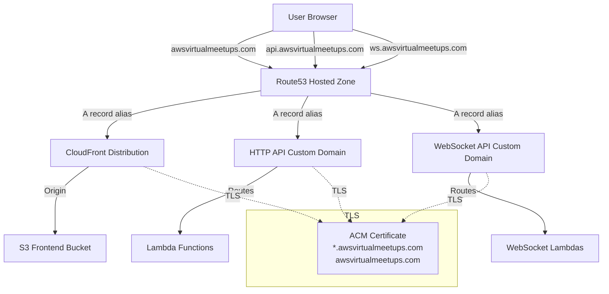
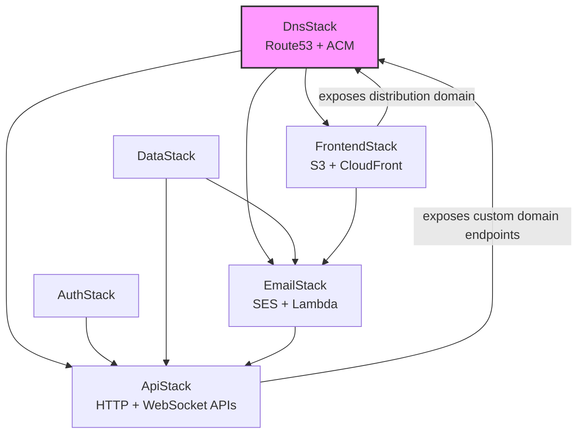
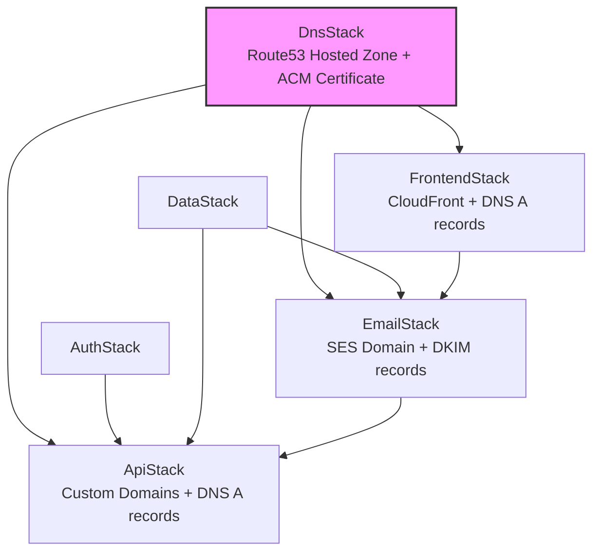

# Design Document: Custom Domain

## Overview

This design adds custom domain support for the AWS Virtual Meetups platform, mapping `awsvirtualmeetups.com` and its subdomains to the existing CloudFront distribution, HTTP API Gateway, WebSocket API, and SES email sending. A new `DnsStack` encapsulates Route53, ACM, and DNS record management, while existing stacks receive cross-stack references for certificate and hosted zone resources.

The domain layout:

| Subdomain | Service | Purpose |
|-----------|---------|---------|
| `awsvirtualmeetups.com` | CloudFront | Frontend SPA |
| `www.awsvirtualmeetups.com` | CloudFront | Frontend SPA (www redirect) |
| `api.awsvirtualmeetups.com` | HTTP API Gateway | REST API |
| `ws.awsvirtualmeetups.com` | WebSocket API Gateway | Real-time communication |
| `noreply@awsvirtualmeetups.com` | SES | Outbound email |

## Architecture

### DNS Resolution Flow



### CDK Stack Dependency Graph



**Note on circular dependency:** The DnsStack needs CloudFront distribution domain and API custom domain endpoints to create alias records, but those stacks need the certificate from DnsStack. This is resolved by splitting DnsStack deployment into two phases:

1. **Phase 1 (DnsStack initial):** Creates hosted zone and ACM certificate. Exports zone and cert.
2. **Phase 2 (Frontend/API/Email stacks):** Consume certificate ARN and hosted zone, create custom domains.
3. **Phase 3 (DnsStack DNS records):** A separate construct within DnsStack or a post-deployment step creates alias A records pointing to the CloudFront distribution and API custom domain endpoints passed back as props.

The cleaner CDK approach: DnsStack creates the hosted zone and certificate. FrontendStack, ApiStack, and EmailStack consume these and create their own DNS records in the hosted zone (passed as a cross-stack reference). This avoids circular dependencies entirely.

### Revised Dependency Graph (No Circular Dependencies)



Each consuming stack creates its own Route53 records using the hosted zone reference from DnsStack. This is the standard CDK pattern for avoiding circular cross-stack references.

## Components and Interfaces

### DnsStack (New)

**File:** `cdk/lib/dns-stack.js`

```javascript
class DnsStack extends Stack {
  constructor(scope, id, props) {
    // Props: { env }
    // Creates:
    //   - Route53 Public Hosted Zone for awsvirtualmeetups.com
    //   - ACM Certificate (apex + wildcard, DNS-validated against the hosted zone)
    // Exports:
    //   - this.hostedZone (IHostedZone)
    //   - this.certificate (ICertificate)
  }
}
```

**Exported Properties:**

| Property | Type | Description |
|----------|------|-------------|
| `hostedZone` | `route53.IHostedZone` | The Route53 hosted zone for `awsvirtualmeetups.com` |
| `certificate` | `acm.ICertificate` | Wildcard + apex ACM certificate |

**CloudFormation Outputs:**

| Output | Value | Purpose |
|--------|-------|---------|
| `HostedZoneId` | Zone ID | Reference for manual NS delegation |
| `NameServers` | NS records (comma-separated) | Configure at domain registrar |
| `CertificateArn` | Certificate ARN | Cross-stack reference |

### FrontendStack (Modified)

**New Props:**

| Property | Type | Description |
|----------|------|-------------|
| `hostedZone` | `route53.IHostedZone` | For creating A records |
| `certificate` | `acm.ICertificate` | For CloudFront TLS |
| `domainNames` | `string[]` | `['awsvirtualmeetups.com', 'www.awsvirtualmeetups.com']` |

**Changes:**
1. Add `domainNames` and `certificate` to CloudFront distribution config
2. Create Route53 A record aliases for apex and www pointing to the distribution
3. Inject `API_BASE_URL` and `WS_BASE_URL` into frontend config (via S3 deployment or build-time injection)

### ApiStack (Modified)

**New Props:**

| Property | Type | Description |
|----------|------|-------------|
| `hostedZone` | `route53.IHostedZone` | For creating A records |
| `certificate` | `acm.ICertificate` | For API Gateway custom domain TLS |

**Changes:**
1. Create HTTP API custom domain `api.awsvirtualmeetups.com` with certificate
2. Create API mapping from custom domain to HTTP API default stage
3. Create Route53 A record alias for `api.awsvirtualmeetups.com`
4. Create WebSocket API custom domain `ws.awsvirtualmeetups.com` with certificate
5. Create API mapping from custom domain to WebSocket API `prod` stage
6. Create Route53 A record alias for `ws.awsvirtualmeetups.com`
7. Update CORS `allowOrigins` from `['*']` to `['https://awsvirtualmeetups.com', 'https://www.awsvirtualmeetups.com']`

### EmailStack (Modified)

**New Props:**

| Property | Type | Description |
|----------|------|-------------|
| `hostedZone` | `route53.IHostedZone` | For DKIM CNAME records |

**Changes:**
1. Replace `ses.Identity.email(...)` with `ses.Identity.publicHostedZone(hostedZone)`
2. SES domain identity automatically creates DKIM CNAME records in the hosted zone
3. Update `SES_SENDER` environment variable to `noreply@awsvirtualmeetups.com`
4. Add MX record for SES inbound (optional, for bounce handling)

### CDK App Entry Point (Modified)

**File:** `cdk/bin/app.js`

**Changes:**
1. Import and instantiate `DnsStack` before other stacks
2. Pass `hostedZone` and `certificate` to FrontendStack, ApiStack, and EmailStack
3. Add dependency declarations: Frontend/API/Email depend on DnsStack

### Frontend Configuration (Modified)

**File:** `frontend/index.html`

**Changes:**
```javascript
// Before:
window.API_BASE_URL = 'https://d2fnfkz3hf.execute-api.us-east-1.amazonaws.com';
window.WS_BASE_URL = 'wss://0b5r6cb8gd.execute-api.us-east-1.amazonaws.com/prod';

// After:
window.API_BASE_URL = 'https://api.awsvirtualmeetups.com';
window.WS_BASE_URL = 'wss://ws.awsvirtualmeetups.com';
```

## Data Models

### DNS Records Created

| Record Type | Name | Target | Created By |
|-------------|------|--------|------------|
| NS | `awsvirtualmeetups.com` | (auto-assigned by Route53) | DnsStack |
| SOA | `awsvirtualmeetups.com` | (auto-assigned by Route53) | DnsStack |
| CNAME | `_acme-challenge.awsvirtualmeetups.com` | ACM validation value | DnsStack (via DnsValidatedCertificate) |
| A (alias) | `awsvirtualmeetups.com` | CloudFront distribution | FrontendStack |
| A (alias) | `www.awsvirtualmeetups.com` | CloudFront distribution | FrontendStack |
| A (alias) | `api.awsvirtualmeetups.com` | HTTP API regional domain | ApiStack |
| A (alias) | `ws.awsvirtualmeetups.com` | WebSocket API regional domain | ApiStack |
| CNAME x3 | `*._domainkey.awsvirtualmeetups.com` | DKIM tokens | EmailStack (via SES) |
| MX | `awsvirtualmeetups.com` | `10 inbound-smtp.us-east-1.amazonaws.com` | EmailStack |

### ACM Certificate Details

| Field | Value |
|-------|-------|
| Domain Name | `awsvirtualmeetups.com` |
| Subject Alternative Names | `*.awsvirtualmeetups.com` |
| Validation Method | DNS |
| Region | `us-east-1` |
| Key Algorithm | RSA 2048 (default) |

### API Gateway Custom Domain Configuration

| Custom Domain | API | Stage | Base Path |
|---------------|-----|-------|-----------|
| `api.awsvirtualmeetups.com` | HTTP API | `$default` | `/` |
| `ws.awsvirtualmeetups.com` | WebSocket API | `prod` | `/` |

## Error Handling

### Certificate Validation Timeout

**Problem:** ACM DNS validation requires the hosted zone name servers to be delegated at the registrar. Until delegation is complete, the CNAME validation records are not resolvable from the internet, and the certificate remains in `PENDING_VALIDATION` state.

**Mitigation:**
- CDK's `DnsValidatedCertificate` (deprecated) or the newer `Certificate` with `validation: CertificateValidation.fromDns(hostedZone)` will create the validation CNAME records in Route53 automatically.
- The CDK deployment will wait (up to 72 hours by default via CloudFormation) for the certificate to be issued.
- **Manual step required:** After the first DnsStack deployment, the operator must update the domain registrar's NS records to point to the Route53 hosted zone name servers. Only then will ACM validation succeed.
- Document this in a deployment runbook with clear instructions.

**Recovery:** If the certificate times out, delete the stack and redeploy after NS delegation is confirmed.

### DNS Propagation Delays

**Problem:** After NS delegation, DNS changes can take 24-48 hours to propagate globally.

**Mitigation:**
- Use low TTL values (300 seconds) for initial records.
- Verify propagation using `dig` or DNS checker tools before proceeding with dependent stack deployments.
- CloudFront and API Gateway custom domains become active immediately once DNS resolves.

### Deployment Ordering Failures

**Problem:** If FrontendStack or ApiStack deploys before the certificate is issued, CloudFormation will fail.

**Mitigation:**
- CDK `addDependency()` ensures DnsStack completes before dependent stacks.
- The certificate construct blocks until issuance (or timeout).
- Recommended deployment sequence:
  1. Deploy DnsStack alone first
  2. Perform NS delegation at registrar
  3. Wait for certificate issuance (check ACM console)
  4. Deploy remaining stacks

### CORS Misconfiguration

**Problem:** Tightening CORS from `*` to specific origins could break existing clients using the CloudFront domain URL.

**Mitigation:**
- Include both the custom domain origins AND the CloudFront distribution URL in CORS allowed origins during transition.
- Remove the CloudFront URL from CORS after confirming all traffic uses the custom domain.

### SES Domain Verification Failure

**Problem:** SES domain identity verification depends on DKIM CNAME records being resolvable.

**Mitigation:**
- DKIM records are created in the same hosted zone, so they resolve as soon as NS delegation is active.
- SES verification typically completes within 72 hours.
- The email sender Lambda continues to work with the old identity until the new one is verified.

## Testing Strategy

### Why Property-Based Testing Does Not Apply

This feature is entirely Infrastructure as Code (AWS CDK stacks creating Route53, ACM, CloudFront, API Gateway, and SES resources). There are no pure functions, parsers, serializers, or business logic transformations. The changes are declarative resource configurations and a static URL update in HTML. Per testing best practices, IaC features should use snapshot tests, CDK assertions, and integration/smoke tests rather than property-based testing.

### Unit Tests (CDK Assertions)

Verify synthesized CloudFormation templates contain expected resources and configurations:

1. **DnsStack assertions:**
   - Template contains `AWS::Route53::HostedZone` with domain `awsvirtualmeetups.com`
   - Template contains `AWS::CertificateManager::Certificate` with correct domain names and DNS validation
   - Certificate has `us-east-1` region (same as stack)
   - Outputs include `HostedZoneId`, `NameServers`, `CertificateArn`

2. **FrontendStack assertions:**
   - CloudFront distribution has `Aliases` containing `awsvirtualmeetups.com` and `www.awsvirtualmeetups.com`
   - CloudFront distribution has `ViewerCertificate` with the ACM certificate ARN
   - Template contains Route53 A records for apex and www

3. **ApiStack assertions:**
   - Template contains `AWS::ApiGatewayV2::DomainName` for `api.awsvirtualmeetups.com`
   - Template contains `AWS::ApiGatewayV2::DomainName` for `ws.awsvirtualmeetups.com`
   - Template contains `AWS::ApiGatewayV2::ApiMapping` for both custom domains
   - HTTP API CORS configuration includes `https://awsvirtualmeetups.com` and `https://www.awsvirtualmeetups.com`
   - Template contains Route53 A records for api and ws subdomains

4. **EmailStack assertions:**
   - Template contains `AWS::SES::EmailIdentity` with domain identity (not email)
   - Email sender Lambda environment has `SES_SENDER` = `noreply@awsvirtualmeetups.com`
   - Template contains DKIM-related DNS records

### Integration Tests

Run after deployment to verify end-to-end functionality:

1. **DNS resolution:** Verify `awsvirtualmeetups.com`, `www`, `api`, and `ws` subdomains resolve to correct targets
2. **TLS certificate:** Verify HTTPS connections succeed with valid certificate for all endpoints
3. **CloudFront serving:** HTTP GET to `https://awsvirtualmeetups.com` returns the SPA
4. **API reachability:** HTTP GET to `https://api.awsvirtualmeetups.com/events` returns valid response
5. **WebSocket connectivity:** WSS connection to `wss://ws.awsvirtualmeetups.com` establishes successfully
6. **CORS headers:** Preflight OPTIONS request from custom domain origin returns correct headers
7. **Email sending:** Verify SES can send from `noreply@awsvirtualmeetups.com` (check DKIM passes)

### Smoke Tests

Post-deployment verification (single execution):

1. Certificate status is `ISSUED` in ACM
2. Route53 hosted zone has expected record count
3. CloudFront distribution status is `Deployed`
4. API Gateway custom domains show `AVAILABLE` status
5. SES domain identity shows `VERIFIED` status with DKIM `SUCCESS`

### Deployment Runbook

**First-time deployment sequence:**

1. `cdk deploy VirtualMeetup-dev-Dns` — Creates hosted zone and starts certificate request
2. Copy NS records from stack output
3. Update domain registrar NS records to Route53 name servers
4. Wait for ACM certificate to show `ISSUED` (monitor in console, typically 5-30 minutes after NS propagation)
5. `cdk deploy --all` — Deploys remaining stacks with custom domain configurations
6. Verify all endpoints via smoke tests
7. Update any external references (documentation, bookmarks) to use new URLs
