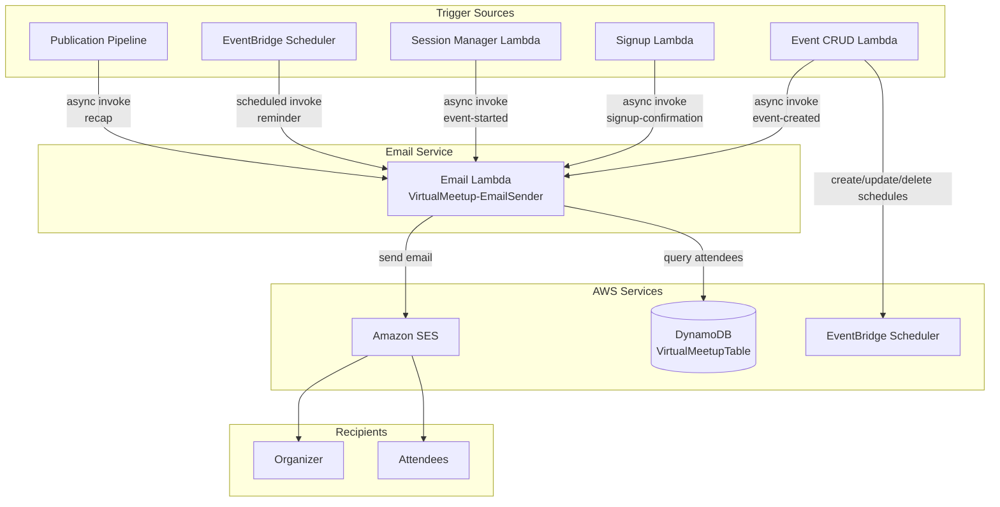
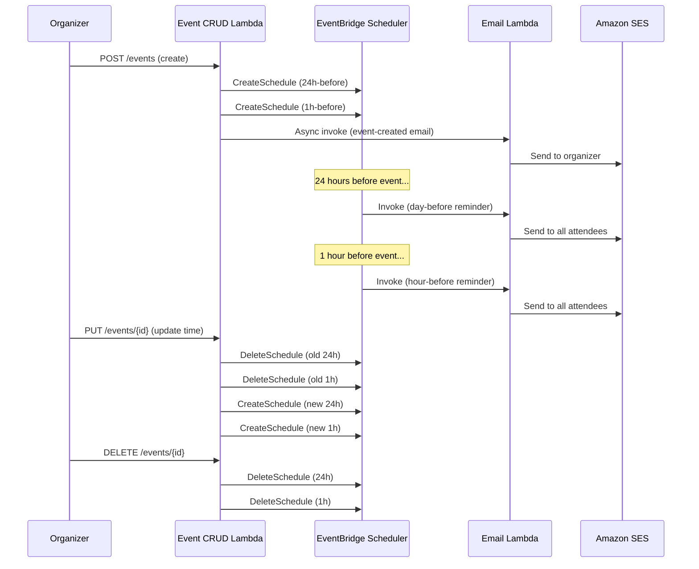
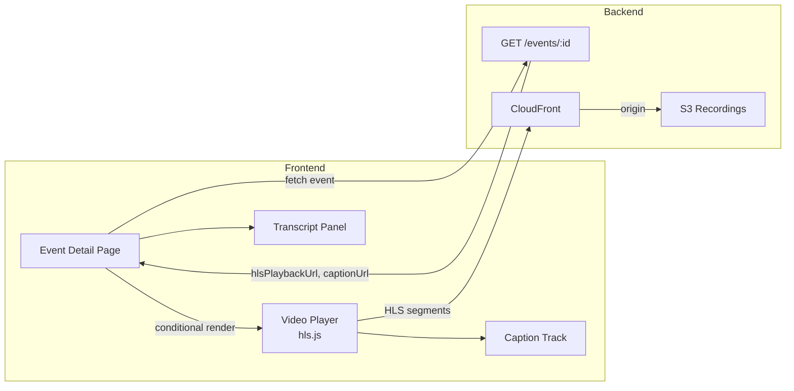

# Design Document: Email Notifications

## Overview

The email notifications feature adds transactional email capabilities to the Virtual Meetup Platform. It sends emails at key lifecycle points: event creation confirmation, sign-up confirmation, day-before and hour-before reminders, event-started notification, and post-event recap with recording link. The system also adds a rich playback experience on the event detail page for past events with recordings.

The implementation uses:
- **Amazon SES** for email delivery (sandbox mode initially, verified sender: `phannah@thenetwerk.net`)
- **Amazon EventBridge Scheduler** for timed reminder triggers (one-time schedules)
- **Asynchronous invocation** to avoid blocking API responses when sending emails
- **HTML email templates** with plain-text fallback, branded with platform identity

### Key Design Decisions

1. **Async email via Lambda invoke (Event type)**: The event-crud and signup Lambdas invoke the email Lambda asynchronously (`InvocationType: 'Event'`). This decouples email delivery from API response latency and provides built-in retry (2 retries on failure).

2. **EventBridge Scheduler over EventBridge Rules**: Scheduler supports one-time schedules with exact fire times, which is ideal for "24 hours before event X" triggers. Rules only support cron/rate patterns.

3. **Single email Lambda**: One Lambda handles all email types, receiving a `type` field in the payload to select the template. This keeps deployment simple and shares template utilities.

4. **Schedule naming convention**: `{eventId}-reminder-24h` and `{eventId}-reminder-1h` — deterministic names allow idempotent create/delete without tracking schedule ARNs in DynamoDB.

5. **SES sandbox mode**: Initially only verified email addresses can receive emails. For production, request SES production access. The architecture doesn't change.

6. **Playback on event detail page**: Rather than a separate playback route, the existing event detail page conditionally renders the video player when `hlsPlaybackUrl` is present in event metadata. This keeps URLs simple and SEO-friendly.

## Architecture

### Email Notification Flow



### Scheduler Lifecycle



### Playback Integration



## Components and Interfaces

### 1. Email Lambda (`cdk/lambda/email-sender/index.js`)

**Purpose**: Composes and sends all transactional emails via SES.

**Invocation Payload**:
```javascript
{
  type: 'event-created' | 'signup-confirmation' | 'day-before-reminder' | 
        'hour-before-reminder' | 'event-started' | 'recap',
  eventId: 'evt_abc123',
  // For single-recipient emails:
  recipientEmail: 'user@example.com',
  recipientName: 'Jane Doe',
  // Event data (included by caller or fetched from DDB):
  eventTitle: 'AWS Lambda Deep Dive',
  eventDescription: 'Learn advanced patterns...',
  scheduledStart: '2024-03-15T18:00:00Z',
  eventUrl: '/events/evt_abc123',
  // For recap:
  playbackUrl: 'https://d2hbje3cen4qrx.cloudfront.net/events/evt_abc123?playback=true',
  duration: 5400 // seconds
}
```

**Behavior by type**:
| Type | Recipients | Data Source |
|------|-----------|-------------|
| `event-created` | Organizer (from payload) | Payload contains all data |
| `signup-confirmation` | Attendee (from payload) | Payload contains all data |
| `day-before-reminder` | All attendees (query DDB) | Payload has eventId, query DDB for event + attendees |
| `hour-before-reminder` | All attendees (query DDB) | Same as above |
| `event-started` | All attendees (query DDB) | Payload has eventId, query DDB |
| `recap` | All attendees (query DDB) | Payload has eventId + playbackUrl |

**Environment Variables**:
- `TABLE_NAME` — DynamoDB table name
- `SES_SENDER` — Verified sender email (`phannah@thenetwerk.net`)
- `FRONTEND_URL` — Frontend base URL (`https://d2hbje3cen4qrx.cloudfront.net`)

### 2. Email Templates (`cdk/lambda/email-sender/templates.js`)

**Purpose**: Renders HTML and plain-text email bodies for each email type.

**Interface**:
```javascript
/**
 * Render an email template.
 * @param {string} type - Email type
 * @param {object} data - Template data (event title, URL, etc.)
 * @returns {{ subject: string, html: string, text: string }}
 */
function renderTemplate(type, data) { ... }

/**
 * Format a date for display in emails.
 * @param {string} isoDate - ISO 8601 date string
 * @returns {string} Human-readable date with timezone (e.g., "Saturday, March 15, 2024 at 6:00 PM UTC")
 */
function formatEmailDate(isoDate) { ... }
```

**Template Structure** (all types):
- Subject: `[Virtual Meetup Platform] {type-specific subject}`
- HTML body: Branded header (AWS orange), content section, footer with unsubscribe note
- Plain-text body: Same content without HTML formatting
- Footer: "You received this email because you registered on Virtual Meetup Platform. To unsubscribe, contact us at {platform email}."

### 3. Scheduler Utilities (`cdk/lambda/shared/scheduler-utils.js`)

**Purpose**: Create, update, and delete EventBridge Scheduler schedules for event reminders.

**Interface**:
```javascript
/**
 * Create reminder schedules for an event.
 * Only creates schedules for times that are still in the future.
 * @param {string} eventId - Event ID
 * @param {string} scheduledStart - ISO 8601 event start time
 * @param {string} emailLambdaArn - ARN of the email sender Lambda
 * @param {string} roleArn - ARN of the scheduler execution role
 */
async function createReminderSchedules(eventId, scheduledStart, emailLambdaArn, roleArn) { ... }

/**
 * Delete all reminder schedules for an event.
 * @param {string} eventId - Event ID
 */
async function deleteReminderSchedules(eventId) { ... }

/**
 * Compute the schedule time for a reminder.
 * @param {string} scheduledStart - ISO 8601 event start time
 * @param {number} offsetMs - Milliseconds before event to fire (e.g., 24*60*60*1000)
 * @returns {Date} The computed trigger time
 */
function computeScheduleTime(scheduledStart, offsetMs) { ... }

/**
 * Build the schedule name for an event reminder.
 * @param {string} eventId - Event ID
 * @param {string} reminderType - '24h' or '1h'
 * @returns {string} Schedule name (e.g., 'evt_abc123-reminder-24h')
 */
function buildScheduleName(eventId, reminderType) { ... }
```

### 4. CDK Email Stack (`cdk/lib/email-stack.js`)

**Purpose**: Defines the email notification infrastructure.

**Resources**:
- Email Sender Lambda function
- SES email identity (verified sender)
- EventBridge Scheduler Group (`VirtualMeetup-Reminders`)
- IAM Role for Scheduler to invoke Lambda
- IAM permissions for email Lambda (SES send, DynamoDB read)
- Dead Letter Queue for failed email sends

### 5. Event Detail Page Playback Enhancement (`frontend/js/playback.js`)

**Enhancements to existing playback module**:
- Download button for recording file
- Screenshot button (canvas capture of current frame)
- Deep-link timestamp support (`?t=120` seeks to 2:00)
- Language selector for captions/transcripts
- Full transcript panel with clickable timestamps
- Conditional rendering based on `hlsPlaybackUrl` presence

### 6. Integration Points (modifications to existing Lambdas)

**Event CRUD Lambda** (`cdk/lambda/event-crud/index.js`):
- After `createEvent`: async invoke email Lambda with `event-created` type + create schedules
- After `updateEvent` (if scheduledStart changed): delete old schedules, create new ones
- After `deleteEvent`: delete schedules

**Signup Lambda** (`cdk/lambda/signup/index.js`):
- After successful sign-up: async invoke email Lambda with `signup-confirmation` type

**Session Manager Lambda** (`cdk/lambda/session-manager/index.js`):
- After event start: async invoke email Lambda with `event-started` type

**Publisher Lambda** (`cdk/lambda/publisher/index.js`):
- After successful publication: async invoke email Lambda with `recap` type

## Data Models

### Email Lambda Invocation Payloads

No new DynamoDB entities are needed. The email Lambda reads existing data:

**Query: Get all attendees for an event**
```javascript
// KeyConditionExpression: PK = :pk AND begins_with(SK, :skPrefix)
// :pk = EVENT#{eventId}
// :skPrefix = SIGNUP#
// Returns: [{ userId, displayName, email, registeredAt }]
```

**Query: Get event metadata**
```javascript
// Key: { PK: EVENT#{eventId}, SK: METADATA }
// Returns: { title, description, scheduledStart, status, ownerEmail, hlsPlaybackUrl, ... }
```

### EventBridge Scheduler Schedule Format

```json
{
  "Name": "evt_abc123-reminder-24h",
  "GroupName": "VirtualMeetup-Reminders",
  "ScheduleExpression": "at(2024-03-14T18:00:00)",
  "ScheduleExpressionTimezone": "UTC",
  "FlexibleTimeWindow": { "Mode": "OFF" },
  "Target": {
    "Arn": "arn:aws:lambda:us-east-1:911445170957:function:VirtualMeetup-EmailSender",
    "RoleArn": "arn:aws:iam::911445170957:role/VirtualMeetup-SchedulerRole",
    "Input": "{\"type\":\"day-before-reminder\",\"eventId\":\"evt_abc123\"}"
  },
  "ActionAfterCompletion": "DELETE"
}
```

Key points:
- `ActionAfterCompletion: DELETE` — schedule auto-deletes after firing (no cleanup needed)
- `FlexibleTimeWindow: OFF` — fire at exact time, not within a window
- Schedule names are deterministic from eventId — enables idempotent create/delete

### SES Email Parameters

```javascript
{
  Source: 'Virtual Meetup Platform <phannah@thenetwerk.net>',
  Destination: {
    ToAddresses: ['attendee@example.com']
  },
  Message: {
    Subject: { Data: '[Virtual Meetup Platform] Your event is starting now!' },
    Body: {
      Html: { Data: '<html>...</html>' },
      Text: { Data: 'Plain text version...' }
    }
  }
}
```

## Correctness Properties

*A property is a characteristic or behavior that should hold true across all valid executions of a system — essentially, a formal statement about what the system should do. Properties serve as the bridge between human-readable specifications and machine-verifiable correctness guarantees.*

### Property 1: Email Template Content Completeness

*For any* valid event data (title, description, scheduledStart, eventUrl) and any email type, the rendered email template SHALL contain all fields specified for that email type in both the HTML and plain-text bodies.

**Validates: Requirements 1.2, 2.2, 3.3, 4.3, 5.2, 6.2**

### Property 2: Email Failure Resilience

*For any* email send operation that encounters an SES error, the email handler function SHALL resolve without throwing an exception, and the error SHALL be logged with the eventId and recipient email.

**Validates: Requirements 1.4, 2.4, 5.4, 6.5**

### Property 3: Schedule Time Calculation

*For any* valid future scheduledStart date and any offset duration (24 hours or 1 hour), the computed trigger time SHALL equal the scheduledStart minus the offset duration exactly.

**Validates: Requirements 3.1, 4.1**

### Property 4: Bulk Email Sends to All Attendees

*For any* event with N registered attendees (N > 0), the bulk email function SHALL produce exactly N email send calls, one for each unique attendee email address.

**Validates: Requirements 3.2, 4.2, 5.1, 6.1**

### Property 5: Scheduler Cleanup on Event Delete

*For any* event with associated reminder schedules, deleting the event SHALL result in deletion of all reminder schedules (both 24h and 1h) identified by the deterministic naming convention `{eventId}-reminder-{type}`.

**Validates: Requirements 3.4, 4.4, 8.2**

### Property 6: Scheduler Update Replaces Triggers

*For any* event whose scheduledStart is updated from time T1 to time T2, the scheduler SHALL delete the schedules computed from T1 and create new schedules computed from T2.

**Validates: Requirements 8.1**

### Property 7: Conditional Schedule Creation for Past Times

*For any* event with scheduledStart S, the scheduler SHALL only create reminder schedules whose computed trigger time (S minus offset) is in the future. Schedules with trigger times in the past SHALL NOT be created.

**Validates: Requirements 8.4**

### Property 8: Email Structural Format

*For any* composed email regardless of type or input data, the email SHALL have: (a) a non-empty HTML body, (b) a non-empty plain-text body, (c) a subject line containing "Virtual Meetup Platform", and (d) an unsubscribe instruction in the footer.

**Validates: Requirements 9.1, 9.2, 9.3**

### Property 9: Date Formatting Includes Timezone

*For any* valid ISO 8601 date string, the formatted email date output SHALL contain a human-readable date representation including a timezone identifier (e.g., "UTC", "EST").

**Validates: Requirements 9.4**

### Property 10: Timestamp Deep-Link Parsing

*For any* non-negative integer timestamp parameter value (in seconds), the deep-link parser SHALL correctly convert it to a seek position, and seeking to that position SHALL set the video currentTime to the specified number of seconds.

**Validates: Requirements 7.6**

### Property 11: Event Detail Page Metadata Display

*For any* event data containing a title, description, and scheduledStart, the rendered event detail page SHALL display all three fields alongside the video player when a playback URL is present.

**Validates: Requirements 7.4**

## Error Handling

### Email Delivery Failures

| Scenario | Handling |
|----------|----------|
| SES returns error (throttle, bounce, etc.) | Log error with eventId + recipient, continue processing remaining recipients |
| Email Lambda timeout | DLQ captures failed invocation; CloudWatch alarm triggers |
| Invalid recipient email | SES rejects; logged as delivery failure |
| SES sandbox — unverified recipient | Email silently fails in sandbox; logged. No impact on production (after moving to production mode) |

### Scheduler Failures

| Scenario | Handling |
|----------|----------|
| Schedule creation fails | Log error; event creation still succeeds (email is best-effort) |
| Schedule fires for deleted event | Email Lambda queries event, finds it missing/cancelled, logs orphan and skips |
| Schedule deletion fails on event delete | Log warning; schedule will fire but Lambda handles orphan case gracefully |
| Duplicate schedule creation (idempotent) | EventBridge Scheduler `CreateSchedule` with same name overwrites — safe |

### Playback Failures

| Scenario | Handling |
|----------|----------|
| HLS manifest not found (404) | Show user-friendly error: "Recording not yet available" |
| hls.js network error | Retry with `hls.startLoad()`; show error after 3 failures |
| Caption file not found | Gracefully degrade — no captions shown, no error displayed |
| Invalid timestamp parameter | Default to start (0 seconds); ignore malformed values |

### General Principles

- Email sending is **fire-and-forget** — never blocks the calling operation
- All email failures are **logged** with structured data (eventId, recipient, error message)
- **Dead Letter Queue** captures Lambda invocation failures for manual review
- **CloudWatch alarms** on DLQ depth and email Lambda error rate
- Scheduler operations use **try/catch** — failures don't break event CRUD operations

## Testing Strategy

### Property-Based Tests (fast-check)

Property-based testing is appropriate for this feature because:
- Email template rendering is a pure function with clear input/output
- Schedule time calculation is pure arithmetic
- Date formatting is a pure transformation
- These functions have large input spaces (arbitrary strings, dates, attendee counts)

**Library**: `fast-check` (already in project devDependencies)
**Configuration**: Minimum 100 iterations per property test
**Tag format**: `Feature: email-notifications, Property {N}: {description}`

Tests will be placed in `cdk/test/property/email-notifications.property.test.js`.

### Unit Tests

Located in `cdk/test/unit/`:

| Test File | Coverage |
|-----------|----------|
| `email-sender.test.js` | Email Lambda handler routing, SES call construction, error handling |
| `email-templates.test.js` | Template rendering for each email type, edge cases (long titles, special chars) |
| `scheduler-utils.test.js` | Schedule creation/deletion, naming convention, past-time filtering |
| `playback-enhanced.test.js` | Download button, screenshot, timestamp parsing, transcript panel |

### Integration Tests

| Test | What it validates |
|------|-------------------|
| Email delivery (SES sandbox) | Verified sender can send to verified recipient |
| Scheduler create/fire/delete | Full lifecycle of a one-time schedule |
| Event CRUD → email trigger | Creating an event triggers async email Lambda invocation |

### Example-Based Tests (specific scenarios)

- From address is always `phannah@thenetwerk.net` (Requirements 1.3, 2.3, 5.3, 6.4)
- Recap email mentions captions, transcript, download, screenshot features (Requirement 6.3)
- No recap sent when recording unavailable (Requirement 6.6)
- Video player hidden when no playback URL (Requirement 7.2)
- Video player shown when playback URL present (Requirement 7.1)
- hls.js initialization (Requirement 7.3)
- Download button rendered (Requirement 7.5)
- Screenshot button rendered (Requirement 7.7)
- Caption track loaded (Requirement 7.8)
- Language selector rendered (Requirement 7.9)
- Transcript panel with clickable timestamps (Requirement 7.10)
- Empty attendee list skips sending (Requirements 3.5, 4.5)
- Orphaned trigger (deleted event) skips sending (Requirement 8.3)
