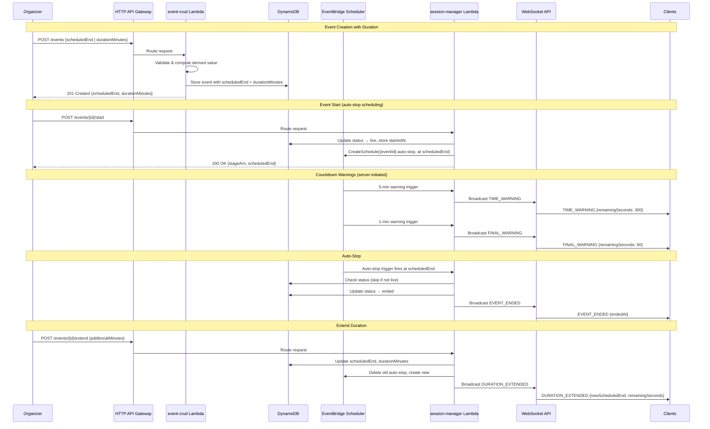
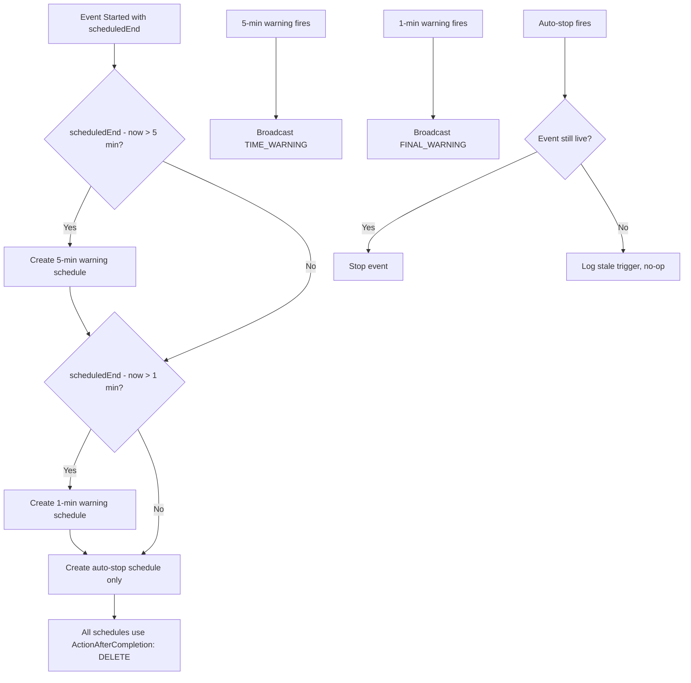

# Design Document: Event Duration

## Overview

This design adds event duration management to the Virtual Meetup Platform. Organizers can specify either a `scheduledEnd` timestamp or a `durationMinutes` value when creating/updating events. The system computes the derived value, validates constraints, schedules an auto-stop via EventBridge Scheduler, broadcasts countdown warnings over WebSocket, and supports live extensions. The implementation extends existing modules (event-crud, session-manager, scheduler-utils, websocket signaling, email templates) rather than introducing new Lambda functions.

### Key Design Decisions

1. **Client-side countdown**: The server provides `scheduledEnd` in session state; clients compute remaining time locally. Server-side warnings are broadcast only at 5-minute and 1-minute thresholds to minimize WebSocket traffic.
2. **Extend endpoint on session-manager**: The extend operation is routed through the session-manager Lambda (POST /events/{id}/extend) because it modifies live session state and requires auto-stop rescheduling.
3. **Distinct schedule naming**: Auto-stop schedules use `{eventId}-auto-stop` to avoid collisions with existing `{eventId}-reminder-{type}` patterns.
4. **EventBridge Scheduler with ActionAfterCompletion: DELETE**: Auto-stop schedules self-delete after firing, preventing stale triggers.
5. **Session-manager as auto-stop target**: The auto-stop schedule invokes the session-manager Lambda directly (not the HTTP API) to avoid auth complexity for scheduled invocations.

## Architecture

### System Flow Diagram



### Warning Schedule Architecture



## Components and Interfaces

### 1. scheduler-utils.js — New Exports

```javascript
/**
 * Build the auto-stop schedule name for an event.
 * @param {string} eventId - Event ID.
 * @returns {string} Schedule name, e.g. 'evt_abc123-auto-stop'.
 */
function buildAutoStopScheduleName(eventId) {
  return `${eventId}-auto-stop`;
}

/**
 * Build a warning schedule name for an event.
 * @param {string} eventId - Event ID.
 * @param {string} warningType - '5min' or '1min'.
 * @returns {string} Schedule name, e.g. 'evt_abc123-warning-5min'.
 */
function buildWarningScheduleName(eventId, warningType) {
  return `${eventId}-warning-${warningType}`;
}

/**
 * Create the auto-stop schedule for a live event.
 * @param {string} eventId - Event ID.
 * @param {string} scheduledEnd - ISO 8601 end time.
 * @param {string} sessionManagerArn - ARN of the session-manager Lambda.
 * @param {string} roleArn - ARN of the scheduler execution role.
 */
async function createAutoStopSchedule(eventId, scheduledEnd, sessionManagerArn, roleArn) { }

/**
 * Delete the auto-stop schedule for an event.
 * @param {string} eventId - Event ID.
 */
async function deleteAutoStopSchedule(eventId) { }

/**
 * Create countdown warning schedules (5-min and 1-min before end).
 * Only creates schedules for times still in the future.
 * @param {string} eventId - Event ID.
 * @param {string} scheduledEnd - ISO 8601 end time.
 * @param {string} sessionManagerArn - ARN of the session-manager Lambda.
 * @param {string} roleArn - ARN of the scheduler execution role.
 */
async function createWarningSchedules(eventId, scheduledEnd, sessionManagerArn, roleArn) { }

/**
 * Delete all warning schedules for an event.
 * @param {string} eventId - Event ID.
 */
async function deleteWarningSchedules(eventId) { }
```

### 2. event-crud Lambda — Updated Create/Update Logic

```javascript
// New fields in create/update request body:
// - scheduledEnd: string (ISO 8601) — optional
// - durationMinutes: number (positive integer, max 480) — optional
// Mutual exclusivity: providing both is a 400 error.

/**
 * Compute derived duration fields.
 * @param {string} scheduledStart - ISO 8601 start time.
 * @param {Object} data - Request body with optional scheduledEnd or durationMinutes.
 * @returns {{ scheduledEnd: string, durationMinutes: number } | null} Computed values or null for open-ended.
 */
function computeDurationFields(scheduledStart, data) {
  if (data.scheduledEnd && data.durationMinutes) {
    throw new ValidationError('Only one of scheduledEnd or durationMinutes may be provided');
  }
  if (data.scheduledEnd) {
    const start = new Date(scheduledStart).getTime();
    const end = new Date(data.scheduledEnd).getTime();
    return { scheduledEnd: data.scheduledEnd, durationMinutes: Math.round((end - start) / 60000) };
  }
  if (data.durationMinutes) {
    const start = new Date(scheduledStart).getTime();
    const end = new Date(start + data.durationMinutes * 60000).toISOString();
    return { scheduledEnd: end, durationMinutes: data.durationMinutes };
  }
  return null; // open-ended
}

/**
 * Validate duration fields.
 * @param {string} scheduledEnd - ISO 8601 end time.
 * @param {number} durationMinutes - Duration in minutes.
 * @param {string} scheduledStart - ISO 8601 start time.
 * @returns {{ valid: boolean, error: string | null }}
 */
function validateDurationFields(scheduledEnd, durationMinutes, scheduledStart) { }
```

### 3. session-manager Lambda — New Extend Handler

```javascript
/**
 * Extend a live event's duration.
 * POST /events/{id}/extend
 * Body: { additionalMinutes: number }
 *
 * @param {Object} event - API Gateway event.
 * @param {string} eventId - Event ID.
 * @returns {Object} HTTP response.
 */
async function extendEvent(event, eventId) { }

/**
 * Handle auto-stop invocation from EventBridge Scheduler.
 * Invoked directly (not via HTTP API).
 * Payload: { action: 'auto-stop', eventId: string }
 *
 * @param {Object} schedulerEvent - EventBridge Scheduler payload.
 * @returns {Object} Result.
 */
async function handleAutoStop(schedulerEvent) { }

/**
 * Handle warning invocation from EventBridge Scheduler.
 * Payload: { action: 'time-warning', eventId: string, warningType: '5min' | '1min' }
 *
 * @param {Object} schedulerEvent - EventBridge Scheduler payload.
 * @returns {Object} Result.
 */
async function handleTimeWarning(schedulerEvent) { }
```

### 4. WebSocket Message Formats

```javascript
// TIME_WARNING — broadcast at 5 minutes before scheduledEnd
{
  type: 'TIME_WARNING',
  eventId: 'evt_abc123',
  data: {
    remainingSeconds: 300,
    scheduledEnd: '2024-03-15T19:00:00.000Z',
    message: 'Event ending in 5 minutes'
  }
}

// FINAL_WARNING — broadcast at 1 minute before scheduledEnd
{
  type: 'FINAL_WARNING',
  eventId: 'evt_abc123',
  data: {
    remainingSeconds: 60,
    scheduledEnd: '2024-03-15T19:00:00.000Z',
    message: 'Event ending in 1 minute'
  }
}

// DURATION_EXTENDED — broadcast when organizer extends
{
  type: 'DURATION_EXTENDED',
  eventId: 'evt_abc123',
  data: {
    newScheduledEnd: '2024-03-15T19:30:00.000Z',
    additionalMinutes: 30,
    remainingSeconds: 1800,
    newDurationMinutes: 90
  }
}

// EVENT_ENDED — broadcast on auto-stop or manual stop (already exists, unchanged)
{
  type: 'EVENT_ENDED',
  eventId: 'evt_abc123',
  endedAt: '2024-03-15T19:00:00.000Z'
}
```

### 5. API Changes

| Method | Path | Lambda | Auth | Description |
|--------|------|--------|------|-------------|
| POST | /events/{id}/extend | session-manager | Cognito | Extend live event duration |

**Updated POST /events request body:**
```json
{
  "title": "string (required)",
  "description": "string (required)",
  "scheduledStart": "ISO 8601 (required)",
  "scheduledEnd": "ISO 8601 (optional, mutually exclusive with durationMinutes)",
  "durationMinutes": "number (optional, 1-480, mutually exclusive with scheduledEnd)"
}
```

**Updated PUT /events/{id} request body:**
```json
{
  "title": "string (optional)",
  "description": "string (optional)",
  "scheduledStart": "ISO 8601 (optional)",
  "scheduledEnd": "ISO 8601 (optional, mutually exclusive with durationMinutes)",
  "durationMinutes": "number (optional, 1-480, mutually exclusive with scheduledEnd)"
}
```

**POST /events/{id}/extend request body:**
```json
{
  "additionalMinutes": "number (required, positive integer, new total ≤ 480)"
}
```

**Updated GET /events/{id} response (when live with duration):**
```json
{
  "eventId": "evt_abc123",
  "title": "...",
  "scheduledStart": "2024-03-15T18:00:00.000Z",
  "scheduledEnd": "2024-03-15T19:00:00.000Z",
  "durationMinutes": 60,
  "remainingSeconds": 1523,
  "status": "live",
  "..."
}
```

### 6. CDK Infrastructure Changes (api-stack.js)

```javascript
// New route for extend endpoint
httpApi.addRoutes({
  path: '/events/{id}/extend',
  methods: [HttpMethod.POST],
  integration: sessionManagerIntegration,
  authorizer: cognitoAuthorizer,
});

// session-manager Lambda needs additional environment variable
sessionManagerFn.addEnvironment('SESSION_MANAGER_ARN', sessionManagerFn.functionArn);

// session-manager Lambda needs scheduler permissions
sessionManagerFn.addToRolePolicy(new iam.PolicyStatement({
  effect: iam.Effect.ALLOW,
  actions: ['scheduler:CreateSchedule', 'scheduler:DeleteSchedule'],
  resources: ['*'],
}));

// session-manager Lambda needs iam:PassRole for scheduler role
if (schedulerRole) {
  sessionManagerFn.addToRolePolicy(new iam.PolicyStatement({
    effect: iam.Effect.ALLOW,
    actions: ['iam:PassRole'],
    resources: [schedulerRole.roleArn],
  }));
}
```

## Data Models

### DynamoDB Event Item — New Attributes

| Attribute | Type | Description |
|-----------|------|-------------|
| `scheduledEnd` | String (ISO 8601) | Computed or provided end time. Absent for open-ended events. |
| `durationMinutes` | Number | Duration in minutes (1–480). Absent for open-ended events. |
| `endedAt` | String (ISO 8601) | Actual end time (set on stop). Already exists in current schema. |
| `startedAt` | String (ISO 8601) | Actual start time (set on start). Already exists in current schema. |

### Example DynamoDB Item (with duration)

```json
{
  "PK": "EVENT#evt_abc123",
  "SK": "METADATA",
  "GSI1PK": "EVENTS#UPCOMING",
  "GSI1SK": "2024-03-15T18:00:00.000Z#evt_abc123",
  "eventId": "evt_abc123",
  "title": "AWS CDK Deep Dive",
  "description": "...",
  "scheduledStart": "2024-03-15T18:00:00.000Z",
  "scheduledEnd": "2024-03-15T19:00:00.000Z",
  "durationMinutes": 60,
  "status": "scheduled",
  "ownerUserId": "user_xyz",
  "ownerEmail": "organizer@example.com",
  "createdAt": "2024-03-01T10:00:00.000Z",
  "updatedAt": "2024-03-01T10:00:00.000Z"
}
```

### EventBridge Scheduler Payloads

**Auto-stop target input:**
```json
{
  "action": "auto-stop",
  "eventId": "evt_abc123"
}
```

**Time warning target input:**
```json
{
  "action": "time-warning",
  "eventId": "evt_abc123",
  "warningType": "5min"
}
```


## Correctness Properties

*A property is a characteristic or behavior that should hold true across all valid executions of a system — essentially, a formal statement about what the system should do. Properties serve as the bridge between human-readable specifications and machine-verifiable correctness guarantees.*

### Property 1: Duration computation round-trip

*For any* valid `scheduledStart` (ISO 8601 date) and *for any* positive integer `durationMinutes` in [1, 480], computing `scheduledEnd = scheduledStart + durationMinutes * 60000` and then computing `derivedDuration = (scheduledEnd - scheduledStart) / 60000` should yield the original `durationMinutes` value.

**Validates: Requirements 1.1, 1.2, 3.1, 3.2, 3.3**

### Property 2: Mutual exclusivity rejection

*For any* request body that contains both a non-null `scheduledEnd` and a non-null `durationMinutes`, the `computeDurationFields` function should throw a validation error.

**Validates: Requirements 1.3**

### Property 3: scheduledEnd must be after scheduledStart

*For any* pair of ISO 8601 dates where `scheduledEnd <= scheduledStart`, the duration validation function should reject the input. Conversely, *for any* pair where `scheduledEnd > scheduledStart`, the validation should accept the input.

**Validates: Requirements 2.2, 2.5**

### Property 4: durationMinutes range validation

*For any* numeric value `n`, the duration validation function should accept `n` if and only if `n` is a positive integer and `1 <= n <= 480`. Non-integers, zero, negative numbers, and values exceeding 480 should all be rejected.

**Validates: Requirements 2.3, 2.4, 2.6**

### Property 5: Live events reject duration field updates

*For any* event in "live" status and *for any* update request containing `scheduledEnd` or `durationMinutes`, the event-crud update handler should return a 400 error indicating that extensions must use the dedicated extend endpoint.

**Validates: Requirements 3.4**

### Property 6: Auto-stop is a no-op for non-live events

*For any* event whose status is not "live" (i.e., "scheduled", "ended", "published", or "cancelled"), when the auto-stop handler is invoked for that event, it should take no stop action and return without error.

**Validates: Requirements 4.3, 8.3**

### Property 7: Extension computation correctness

*For any* live event with a current `scheduledEnd` and `durationMinutes`, and *for any* positive integer `additionalMinutes` such that `durationMinutes + additionalMinutes <= 480`, the new `scheduledEnd` should equal `currentScheduledEnd + additionalMinutes * 60000` and the new `durationMinutes` should equal `currentDurationMinutes + additionalMinutes`.

**Validates: Requirements 6.1**

### Property 8: Extension validation

*For any* `additionalMinutes` value and current `durationMinutes`, the extend validation should reject when `additionalMinutes` is not a positive integer OR when `durationMinutes + additionalMinutes > 480`.

**Validates: Requirements 6.2**

### Property 9: Extend rejected for non-live events

*For any* event whose status is not "live" and *for any* valid `additionalMinutes` value, the extend handler should return a 400 error.

**Validates: Requirements 6.5**

### Property 10: Auto-stop schedule name non-collision

*For any* eventId, `buildAutoStopScheduleName(eventId)` should produce a string that does not match the pattern produced by `buildScheduleName(eventId, type)` for any reminder type ('24h', '1h').

**Validates: Requirements 8.4**

### Property 11: Email templates include duration information

*For any* event data containing `scheduledEnd` and `durationMinutes`, rendering the event-created, day-before-reminder, hour-before-reminder, or event-started email templates should produce output (HTML and text) that contains the duration or end time information.

**Validates: Requirements 9.1, 9.2, 9.3**

### Property 12: GET response includes duration fields when present

*For any* event that has `scheduledEnd` and `durationMinutes` stored in DynamoDB, the GET /events/{id} response should include both `scheduledEnd` and `durationMinutes` fields regardless of event status.

**Validates: Requirements 10.1, 10.2, 7.2**

### Property 13: remainingSeconds computation

*For any* live event with a `scheduledEnd` in the future, the `remainingSeconds` field in the GET response should equal `Math.max(0, Math.floor((new Date(scheduledEnd).getTime() - Date.now()) / 1000))`.

**Validates: Requirements 10.3**

## Error Handling

### Validation Errors (400)

| Condition | Error Message |
|-----------|---------------|
| Both `scheduledEnd` and `durationMinutes` provided | "Only one of scheduledEnd or durationMinutes may be provided" |
| `scheduledEnd` is not a valid ISO 8601 date | "scheduledEnd must be a valid ISO 8601 date" |
| `scheduledEnd` is not after `scheduledStart` | "scheduledEnd must be after scheduledStart" |
| `durationMinutes` is not a positive integer | "durationMinutes must be a positive integer" |
| `durationMinutes` exceeds 480 | "durationMinutes must not exceed 480 (8 hours)" |
| Update duration fields on live event | "Cannot update duration on a live event. Use POST /events/{id}/extend instead" |
| `additionalMinutes` is not a positive integer | "additionalMinutes must be a positive integer" |
| New total duration exceeds 480 | "Total duration cannot exceed 480 minutes (8 hours)" |
| Extend on non-live event | "Can only extend duration of a live event" |

### Scheduler Errors (Graceful Degradation)

- **CreateSchedule failure**: Log error, continue with event start. Event will not auto-stop but can be stopped manually.
- **DeleteSchedule failure (schedule not found)**: Log warning, treat as success (schedule may have already self-deleted via ActionAfterCompletion).
- **Stale auto-stop trigger**: Log info message with event status, return without action.

### WebSocket Broadcast Errors

- **GoneException (410)**: Stale connection — clean up from connections table (existing pattern).
- **Broadcast failure**: Log error per connection, continue broadcasting to remaining connections. Never fail the parent operation due to broadcast errors.

### Race Conditions

- **Manual stop vs auto-stop race**: Both paths check event status before stopping. The second to execute will find status !== "live" and no-op. DynamoDB conditional updates can be used for additional safety.
- **Extend vs auto-stop race**: If extend arrives just as auto-stop fires, the auto-stop will find the event still live and stop it. To mitigate, the extend operation should delete the old schedule before creating the new one (delete is idempotent if schedule already fired and self-deleted).

## Testing Strategy

### Property-Based Tests (fast-check)

The project uses `fast-check` for property-based testing (see existing tests in `cdk/test/property/`). Each property test runs a minimum of 100 iterations.

**Test file**: `cdk/test/property/event-duration.property.test.js`

Properties to implement:
1. Duration computation round-trip
2. Mutual exclusivity rejection
3. scheduledEnd after scheduledStart validation
4. durationMinutes range validation
5. Live events reject duration updates
6. Auto-stop no-op for non-live events
7. Extension computation correctness
8. Extension validation
9. Extend rejected for non-live events
10. Auto-stop schedule name non-collision
11. Email templates include duration info
12. GET response includes duration fields
13. remainingSeconds computation

Each test is tagged with: `Feature: event-duration, Property {N}: {title}`

### Unit Tests

**Test file**: `cdk/test/unit/event-duration.test.js`

Focus areas:
- `computeDurationFields` with specific examples (30 min, 60 min, 480 min)
- Open-ended event creation (no duration fields)
- Update flow with scheduledStart change triggering recomputation
- Auto-stop handler routing (action: 'auto-stop' vs HTTP request)
- Warning handler routing (action: 'time-warning')
- Extend endpoint happy path with mocked DynamoDB and Scheduler
- Manual stop cleanup of auto-stop schedule
- Email template rendering with duration data

### Integration Tests

Focus areas:
- EventBridge Scheduler create/delete calls with correct parameters
- WebSocket broadcast of TIME_WARNING, FINAL_WARNING, DURATION_EXTENDED messages
- End-to-end flow: create event with duration → start → auto-stop fires → event ended
- Extend flow: start → extend → old schedule deleted → new schedule created

### Test Configuration

```javascript
// fast-check configuration for property tests
const FC_OPTIONS = { numRuns: 100, seed: Date.now() };
```

### Generators (for property tests)

```javascript
// Generate valid scheduledStart (future ISO date)
const arbScheduledStart = fc.date({ min: new Date(), max: new Date(Date.now() + 365 * 24 * 60 * 60 * 1000) })
  .map(d => d.toISOString());

// Generate valid durationMinutes (1-480)
const arbDurationMinutes = fc.integer({ min: 1, max: 480 });

// Generate invalid durationMinutes (outside valid range)
const arbInvalidDuration = fc.oneof(
  fc.integer({ min: -1000, max: 0 }),
  fc.integer({ min: 481, max: 10000 }),
  fc.double().filter(n => !Number.isInteger(n))
);

// Generate valid additionalMinutes given current duration
const arbAdditionalMinutes = (currentDuration) =>
  fc.integer({ min: 1, max: 480 - currentDuration });

// Generate event status (non-live)
const arbNonLiveStatus = fc.constantFrom('scheduled', 'ended', 'published', 'cancelled');

// Generate any eventId
const arbEventId = fc.string({ minLength: 5, maxLength: 20 })
  .map(s => `evt_${s.replace(/[^a-z0-9]/gi, 'x')}`);
```
