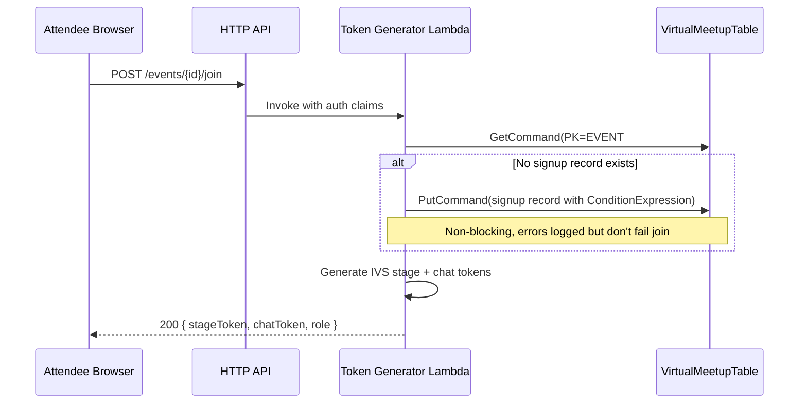
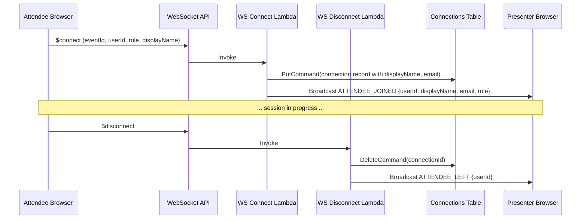
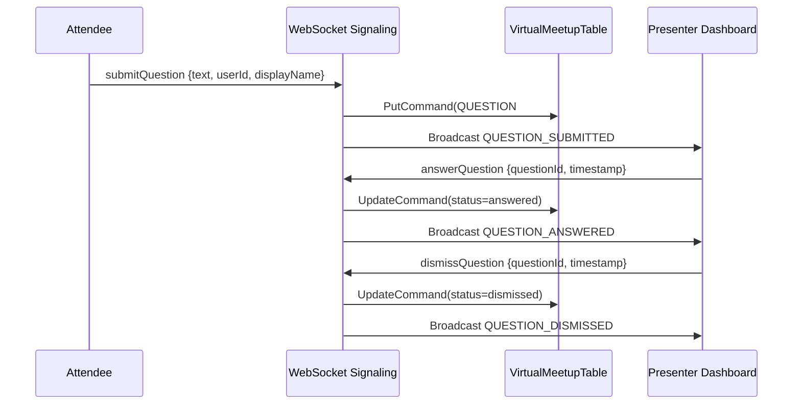
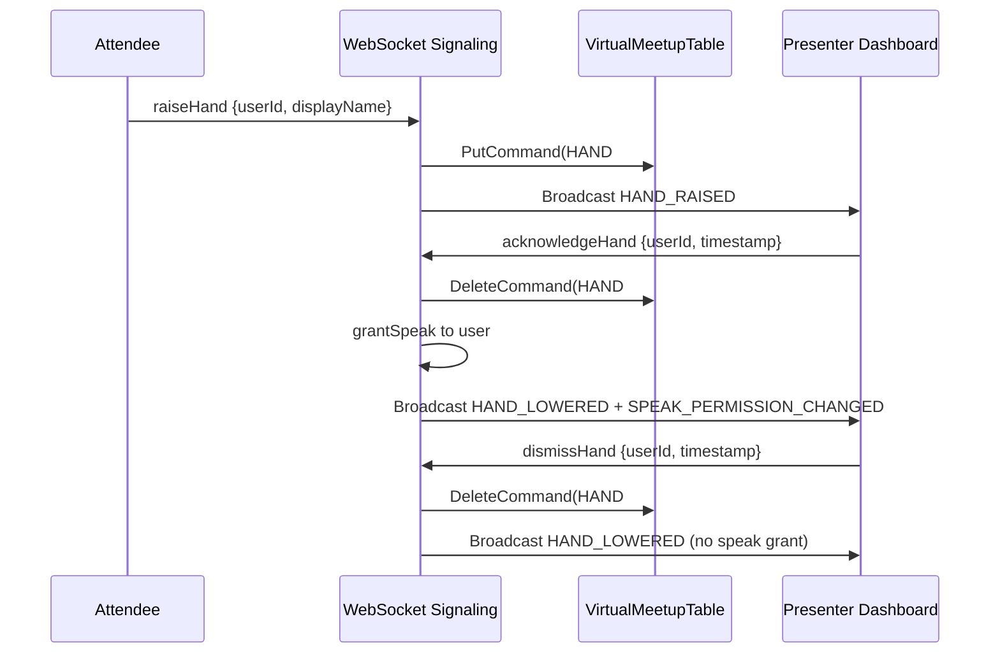

# Design Document: Presenter Dashboard

## Overview

The Presenter Dashboard feature adds four capabilities to the Virtual Meetup Platform:

1. **Auto-Registration on Join** — The Token Generator Lambda automatically creates a signup record when an attendee joins a live event, removing the need for explicit pre-registration.
2. **Presenter Attendee List** — A real-time panel showing currently connected participants, updated via WebSocket connect/disconnect broadcasts.
3. **Presenter Question Queue Panel** — A persistent, ordered list of submitted questions with answer/dismiss controls, backed by DynamoDB and synchronized via WebSocket.
4. **Presenter Raised Hands Management** — A chronological list of raised hands with acknowledge (grant speak) and dismiss actions.

All backend logic integrates with the existing single-table DynamoDB design (VirtualMeetupTable), WebSocket signaling infrastructure, and vanilla JS frontend. No new Lambda functions or DynamoDB tables are required — the feature extends existing handlers and adds a new frontend panel.

## Architecture

```mermaid
flowchart TB
    subgraph Frontend
        LS[live-session.js]
        PD[Presenter Dashboard Panel]
        WS_CLIENT[WebSocket Client]
    end

    subgraph API Gateway
        HTTP[HTTP API]
        WSS[WebSocket API]
    end

    subgraph Lambda
        TG[Token Generator]
        WS_CONNECT[WS Connect]
        WS_DISCONNECT[WS Disconnect]
        WS_SIGNALING[WS Signaling]
    end

    subgraph DynamoDB
        MT[VirtualMeetupTable]
        CT[WebSocketConnections]
    end

    LS --> HTTP
    PD --> WS_CLIENT
    WS_CLIENT --> WSS

    HTTP -->|POST /events/{id}/join| TG
    WSS -->|$connect| WS_CONNECT
    WSS -->|$disconnect| WS_DISCONNECT
    WSS -->|signaling actions| WS_SIGNALING

    TG -->|Check/Create SIGNUP record| MT
    TG -->|Read connection| CT
    WS_CONNECT -->|Store connection + broadcast ATTENDEE_JOINED| CT
    WS_DISCONNECT -->|Delete connection + broadcast ATTENDEE_LEFT| CT
    WS_SIGNALING -->|HAND/QUESTION CRUD + broadcast| MT
    WS_SIGNALING -->|Read connections for broadcast| CT
```

### Data Flow: Auto-Registration



### Data Flow: Attendee List (Real-Time)



### Data Flow: Question Queue Management



### Data Flow: Raised Hands Management



## Components and Interfaces

### 1. Token Generator Lambda (Modified)

**File:** `cdk/lambda/token-generator/index.js`

**New behavior in `joinEvent()`:**
- After authentication and event validation, check for existing signup record
- If none exists, create one (conditional put, fire-and-forget on error)
- Continue with existing token generation logic

```javascript
/**
 * Auto-register attendee if no signup record exists.
 * Non-blocking: errors are logged but do not prevent join.
 *
 * @param {string} eventId - The event identifier.
 * @param {Object} claims - Authenticated user claims {userId, email, displayName}.
 * @returns {Promise<void>}
 */
async function autoRegisterIfNeeded(eventId, claims) {
  const pk = buildEventPK(eventId);
  const sk = buildSignupSK(claims.userId);

  try {
    await docClient.send(new PutCommand({
      TableName: TABLE_NAME,
      Item: {
        PK: pk,
        SK: sk,
        userId: claims.userId,
        displayName: claims.displayName,
        email: claims.email,
        registeredAt: new Date().toISOString(),
        source: 'auto-join',
      },
      ConditionExpression: 'attribute_not_exists(PK)',
    }));
  } catch (err) {
    if (err.name === 'ConditionalCheckFailedException') {
      // Already registered — expected, no action needed
      return;
    }
    // Log but don't block join flow
    console.error('Auto-registration failed', { eventId, userId: claims.userId, error: err.message });
  }
}
```

### 2. WebSocket Connect Handler (Modified)

**File:** `cdk/lambda/websocket/connect.js`

**Changes:**
- Accept `displayName` and `email` in query string parameters
- Store them in the connection record
- Broadcast `ATTENDEE_JOINED` message after storing connection

```javascript
// Updated connection record shape:
{
  connectionId: string,
  eventId: string,
  userId: string,
  role: string,          // 'presenter' | 'co-presenter' | 'attendee'
  displayName: string,   // NEW
  email: string,         // NEW
  connectedAt: string,   // ISO 8601
  ttl: number,
}
```

**New broadcast on connect:**
```javascript
await broadcast(eventId, {
  type: 'ATTENDEE_JOINED',
  eventId,
  data: {
    userId,
    displayName,
    email,
    role,
    connectionId,
  },
});
```

### 3. WebSocket Disconnect Handler (Modified)

**File:** `cdk/lambda/websocket/disconnect.js`

**Changes:**
- Before deleting the connection, read it to get `eventId` and `userId`
- Broadcast `ATTENDEE_LEFT` message to remaining connections

```javascript
// Read connection before delete to get eventId for broadcast
const connection = await docClient.send(new GetCommand({
  TableName: TABLE_NAME,
  Key: { connectionId },
}));

if (connection.Item) {
  await docClient.send(new DeleteCommand({
    TableName: TABLE_NAME,
    Key: { connectionId },
  }));

  await broadcast(connection.Item.eventId, {
    type: 'ATTENDEE_LEFT',
    eventId: connection.Item.eventId,
    data: {
      userId: connection.Item.userId,
      connectionId,
    },
  });
}
```

### 4. WebSocket Signaling Handler (Modified)

**File:** `cdk/lambda/websocket/signaling.js`

**New actions added:**
- `acknowledgeHand` — Removes hand record, grants speak permission, broadcasts
- `dismissHand` — Removes hand record without granting speak, broadcasts
- `getAttendeeList` — Returns current connections for the event (presenter-only)
- `getQuestionQueue` — Returns queued questions for the event (presenter-only)
- `getHandsList` — Returns raised hands for the event (presenter-only)

```javascript
/**
 * Handle acknowledgeHand action.
 * Removes hand record, grants speak permission, broadcasts HAND_LOWERED.
 */
async function handleAcknowledgeHand(eventId, body, connectionId) {
  const userId = body.data?.userId || body.userId;
  const timestamp = body.data?.timestamp || body.timestamp;

  if (!userId || !timestamp) {
    return { statusCode: 400, body: 'Missing userId or timestamp' };
  }

  // Delete hand record
  const pk = buildEventPK(eventId);
  const sk = buildHandSK(timestamp, userId);
  await docClient.send(new DeleteCommand({
    TableName: TABLE_NAME,
    Key: { PK: pk, SK: sk },
  }));

  // Find user's connection and grant speak
  const connections = await getConnectionsForEvent(eventId);
  const userConn = connections.find(c => c.userId === userId);
  if (userConn) {
    await docClient.send(new UpdateCommand({
      TableName: CONNECTIONS_TABLE_NAME,
      Key: { connectionId: userConn.connectionId },
      UpdateExpression: 'SET #hasSpeakPermission = :speak',
      ExpressionAttributeNames: { '#hasSpeakPermission': 'hasSpeakPermission' },
      ExpressionAttributeValues: { ':speak': true },
    }));
  }

  // Broadcast hand lowered
  await broadcast(eventId, {
    type: 'HAND_LOWERED',
    eventId,
    data: { userId, timestamp },
  });

  // Broadcast speak permission change
  if (userConn) {
    await broadcast(eventId, {
      type: 'SPEAK_PERMISSION_CHANGED',
      eventId,
      data: {
        connectionId: userConn.connectionId,
        userId,
        hasSpeakPermission: true,
      },
    });
  }

  return { statusCode: 200, body: 'Hand acknowledged' };
}

/**
 * Handle dismissHand action.
 * Removes hand record without granting speak, broadcasts HAND_LOWERED.
 */
async function handleDismissHand(eventId, body, connectionId) {
  const userId = body.data?.userId || body.userId;
  const timestamp = body.data?.timestamp || body.timestamp;

  if (!userId || !timestamp) {
    return { statusCode: 400, body: 'Missing userId or timestamp' };
  }

  const pk = buildEventPK(eventId);
  const sk = buildHandSK(timestamp, userId);
  await docClient.send(new DeleteCommand({
    TableName: TABLE_NAME,
    Key: { PK: pk, SK: sk },
  }));

  await broadcast(eventId, {
    type: 'HAND_LOWERED',
    eventId,
    data: { userId, timestamp },
  });

  return { statusCode: 200, body: 'Hand dismissed' };
}

/**
 * Handle getAttendeeList action (presenter-only).
 * Returns all current connections for the event.
 */
async function handleGetAttendeeList(eventId, body, connectionId) {
  const connections = await getConnectionsForEvent(eventId);
  const attendees = connections.map(c => ({
    userId: c.userId,
    displayName: c.displayName || '',
    email: c.email || '',
    role: c.role,
    connectionId: c.connectionId,
  }));

  await sendToConnection(connectionId, {
    type: 'ATTENDEE_LIST',
    eventId,
    data: { attendees, count: attendees.length },
  });

  return { statusCode: 200, body: 'Attendee list sent' };
}

/**
 * Handle getQuestionQueue action (presenter-only).
 * Returns all queued questions for the event.
 */
async function handleGetQuestionQueue(eventId, body, connectionId) {
  const pk = buildEventPK(eventId);
  const result = await docClient.send(new QueryCommand({
    TableName: TABLE_NAME,
    KeyConditionExpression: 'PK = :pk AND begins_with(SK, :skPrefix)',
    ExpressionAttributeValues: {
      ':pk': pk,
      ':skPrefix': KEY_PREFIX.QUESTION,
    },
    ScanIndexForward: true,
  }));

  const questions = (result.Items || [])
    .filter(q => q.status === QUESTION_STATUS.QUEUED)
    .map(q => ({
      questionId: q.questionId,
      userId: q.userId,
      displayName: q.displayName,
      text: q.text,
      status: q.status,
      submittedAt: q.submittedAt,
      timestamp: q.submittedAt,
    }));

  await sendToConnection(connectionId, {
    type: 'QUESTION_QUEUE',
    eventId,
    data: { questions, count: questions.length },
  });

  return { statusCode: 200, body: 'Question queue sent' };
}

/**
 * Handle getHandsList action (presenter-only).
 * Returns all raised hands for the event in chronological order.
 */
async function handleGetHandsList(eventId, body, connectionId) {
  const pk = buildEventPK(eventId);
  const result = await docClient.send(new QueryCommand({
    TableName: TABLE_NAME,
    KeyConditionExpression: 'PK = :pk AND begins_with(SK, :skPrefix)',
    ExpressionAttributeValues: {
      ':pk': pk,
      ':skPrefix': KEY_PREFIX.HAND,
    },
    ScanIndexForward: true,
  }));

  const hands = (result.Items || []).map(h => ({
    userId: h.userId,
    displayName: h.displayName,
    timestamp: h.timestamp,
  }));

  await sendToConnection(connectionId, {
    type: 'HANDS_LIST',
    eventId,
    data: { hands, count: hands.length },
  });

  return { statusCode: 200, body: 'Hands list sent' };
}
```

### 5. Frontend Presenter Dashboard Panel

**File:** `frontend/js/live-session.js` (extended)

**New UI panel** rendered only when `userRole === 'presenter'`, containing three tabs:

1. **Attendees Tab** — List of connected participants with count badge
2. **Questions Tab** — Queue of pending questions with Answer/Dismiss buttons
3. **Hands Tab** — Chronological raised hands with Acknowledge/Dismiss buttons

**WebSocket message handlers** update the panel in real-time:
- `ATTENDEE_JOINED` → Add to attendee list, increment count
- `ATTENDEE_LEFT` → Remove from attendee list, decrement count
- `QUESTION_SUBMITTED` → Add to question queue, increment count
- `QUESTION_ANSWERED` / `QUESTION_DISMISSED` → Remove from queue, decrement count
- `HAND_RAISED` → Add to hands list, increment count
- `HAND_LOWERED` → Remove from hands list, decrement count

**Initial load** on dashboard open:
- Send `getAttendeeList` via WebSocket → receive `ATTENDEE_LIST` response
- Send `getQuestionQueue` via WebSocket → receive `QUESTION_QUEUE` response
- Send `getHandsList` via WebSocket → receive `HANDS_LIST` response

### WebSocket Message Formats

#### New Outbound Messages (Client → Server)

| Action | Payload | Description |
|--------|---------|-------------|
| `acknowledgeHand` | `{ eventId, data: { userId, timestamp } }` | Presenter acknowledges hand, grants speak |
| `dismissHand` | `{ eventId, data: { userId, timestamp } }` | Presenter dismisses hand, no speak grant |
| `getAttendeeList` | `{ eventId }` | Request current attendee list |
| `getQuestionQueue` | `{ eventId }` | Request current question queue |
| `getHandsList` | `{ eventId }` | Request current raised hands |

#### New Inbound Messages (Server → Client)

| Type | Payload | Description |
|------|---------|-------------|
| `ATTENDEE_JOINED` | `{ userId, displayName, email, role, connectionId }` | New participant connected |
| `ATTENDEE_LEFT` | `{ userId, connectionId }` | Participant disconnected |
| `ATTENDEE_LIST` | `{ attendees: [...], count }` | Full attendee list response |
| `QUESTION_QUEUE` | `{ questions: [...], count }` | Full question queue response |
| `HANDS_LIST` | `{ hands: [...], count }` | Full raised hands response |

#### Existing Messages (unchanged)

| Type | Notes |
|------|-------|
| `HAND_RAISED` | Already broadcast by `raiseHand` action |
| `HAND_LOWERED` | Already broadcast by `lowerHand` action |
| `QUESTION_SUBMITTED` | Already broadcast by `submitQuestion` action |
| `QUESTION_ANSWERED` | Already broadcast by `answerQuestion` action |
| `QUESTION_DISMISSED` | Already broadcast by `dismissQuestion` action |
| `SPEAK_PERMISSION_CHANGED` | Already broadcast by `grantSpeak` action |

## Data Models

### VirtualMeetupTable (Single-Table Design)

#### Signup Record (Auto-Registration)

| Attribute | Type | Description |
|-----------|------|-------------|
| PK | String | `EVENT#{eventId}` |
| SK | String | `SIGNUP#{userId}` |
| userId | String | Cognito user sub |
| displayName | String | User's display name (from email) |
| email | String | User's email address |
| registeredAt | String | ISO 8601 timestamp |
| source | String | `'auto-join'` or `'manual'` (distinguishes auto vs explicit signup) |

#### Question Record (Existing, unchanged)

| Attribute | Type | Description |
|-----------|------|-------------|
| PK | String | `EVENT#{eventId}` |
| SK | String | `QUESTION#{timestamp}#{questionId}` |
| eventId | String | Event identifier |
| questionId | String | UUID |
| userId | String | Submitter's user ID |
| displayName | String | Submitter's display name |
| text | String | Question content |
| status | String | `'queued'` / `'answered'` / `'dismissed'` |
| submittedAt | String | ISO 8601 timestamp |
| type | String | `'QUESTION'` |

#### Hand Raise Record (Existing, unchanged)

| Attribute | Type | Description |
|-----------|------|-------------|
| PK | String | `EVENT#{eventId}` |
| SK | String | `HAND#{timestamp}#{userId}` |
| eventId | String | Event identifier |
| userId | String | User who raised hand |
| displayName | String | User's display name |
| timestamp | String | ISO 8601 when hand was raised |
| type | String | `'HAND'` |

### WebSocketConnections Table

#### Connection Record (Modified)

| Attribute | Type | Description |
|-----------|------|-------------|
| connectionId | String | PK — WebSocket connection ID |
| eventId | String | Event the connection belongs to |
| userId | String | Authenticated user ID |
| role | String | `'presenter'` / `'co-presenter'` / `'attendee'` |
| displayName | String | **NEW** — User's display name |
| email | String | **NEW** — User's email |
| connectedAt | String | ISO 8601 connection time |
| ttl | Number | Unix epoch TTL for auto-cleanup |
| hasSpeakPermission | Boolean | Whether user can publish audio |
| audioMuted | Boolean | Presenter-imposed audio mute |
| videoDisabled | Boolean | Presenter-imposed video disable |
| chatRestricted | Boolean | Chat restriction flag |
| questionsRestricted | Boolean | Question restriction flag |

### Access Patterns

| Access Pattern | Table | Key Condition | Use Case |
|---------------|-------|---------------|----------|
| Get signup for user | VirtualMeetupTable | PK=`EVENT#{eventId}`, SK=`SIGNUP#{userId}` | Auto-registration check |
| List attendees for event | WebSocketConnections | GSI EventConnections: eventId=`{eventId}` | Attendee list |
| List queued questions | VirtualMeetupTable | PK=`EVENT#{eventId}`, SK begins_with `QUESTION#` | Question queue |
| List raised hands | VirtualMeetupTable | PK=`EVENT#{eventId}`, SK begins_with `HAND#` | Hands panel |
| Get specific hand | VirtualMeetupTable | PK=`EVENT#{eventId}`, SK=`HAND#{timestamp}#{userId}` | Acknowledge/dismiss |
| Get specific question | VirtualMeetupTable | PK=`EVENT#{eventId}`, SK=`QUESTION#{timestamp}#{questionId}` | Answer/dismiss |


## Correctness Properties

*A property is a characteristic or behavior that should hold true across all valid executions of a system — essentially, a formal statement about what the system should do. Properties serve as the bridge between human-readable specifications and machine-verifiable correctness guarantees.*

### Property 1: Auto-registration idempotency

*For any* authenticated user and live event, calling the auto-registration function multiple times SHALL result in exactly one signup record in the Events_Table, with the original registration timestamp preserved.

**Validates: Requirements 1.2, 1.4**

### Property 2: Join resilience under registration failure

*For any* valid join request to a live event, the Token Generator SHALL return valid stage and chat tokens regardless of whether the auto-registration write succeeds, fails, or is skipped due to an existing record.

**Validates: Requirements 1.3, 1.5**

### Property 3: Attendee list completeness and field presence

*For any* set of active connections in the Connections Table for an event, the getAttendeeList response SHALL contain exactly those connections, each with userId, displayName, email, and role fields present, and the count SHALL equal the number of entries.

**Validates: Requirements 2.1, 2.4, 2.5**

### Property 4: ATTENDEE_JOINED broadcast field completeness

*For any* WebSocket connection event with valid parameters (userId, displayName, email, role), the broadcast ATTENDEE_JOINED message SHALL contain all four fields matching the connection parameters.

**Validates: Requirements 2.2**

### Property 5: ATTENDEE_LEFT broadcast correctness

*For any* WebSocket disconnection of a stored connection, the broadcast ATTENDEE_LEFT message SHALL contain the userId of the disconnected user.

**Validates: Requirements 2.3**

### Property 6: Question queue filtering and ordering

*For any* set of question records for an event with mixed statuses (queued, answered, dismissed), the getQuestionQueue response SHALL contain only questions with status "queued", ordered by ascending submittedAt timestamp, each with text, displayName, and submittedAt fields present, and the count SHALL equal the number of queued questions.

**Validates: Requirements 3.1, 3.5, 3.6**

### Property 7: Question status transitions

*For any* question with status "queued", invoking answerQuestion SHALL change its status to "answered", and invoking dismissQuestion SHALL change its status to "dismissed". In both cases, the broadcast message SHALL contain the correct questionId.

**Validates: Requirements 3.2, 3.3**

### Property 8: Real-time question queue growth

*For any* valid QUESTION_SUBMITTED message applied to a question queue state, the queue length SHALL increase by exactly one, and the new entry SHALL contain the submitted question's text, displayName, and submittedAt.

**Validates: Requirements 3.4**

### Property 9: Hands list chronological ordering

*For any* set of hand-raise records for an event, the getHandsList response SHALL return them in ascending timestamp order, each with displayName and timestamp fields present, and the count SHALL equal the number of records.

**Validates: Requirements 4.1, 4.6**

### Property 10: Acknowledge hand grants speak permission

*For any* raised hand record and corresponding connection, invoking acknowledgeHand SHALL delete the hand record from the Events_Table, broadcast a HAND_LOWERED message with the correct userId, and set hasSpeakPermission to true on the user's connection record.

**Validates: Requirements 4.2**

### Property 11: Dismiss hand preserves speak permission state

*For any* raised hand record and corresponding connection, invoking dismissHand SHALL delete the hand record from the Events_Table and broadcast a HAND_LOWERED message with the correct userId, WITHOUT modifying the hasSpeakPermission field on the user's connection record.

**Validates: Requirements 4.3**

### Property 12: Real-time hands list consistency

*For any* HAND_RAISED message applied to a hands list state, the list SHALL grow by one with the new entry matching the message data. For any HAND_LOWERED message where the userId matches an entry in the list, that entry SHALL be removed and the list SHALL shrink by one.

**Validates: Requirements 4.4, 4.5**

## Error Handling

### Auto-Registration Errors

| Error Scenario | Handling | User Impact |
|---------------|----------|-------------|
| DynamoDB PutCommand fails (throttle, network) | Log error, continue with token generation | None — join succeeds |
| ConditionalCheckFailedException | Silently ignore (record already exists) | None — expected case |
| Invalid user claims (missing email) | Use empty string for email, still create record | Minimal — record has partial data |

### WebSocket Connect/Disconnect Errors

| Error Scenario | Handling | User Impact |
|---------------|----------|-------------|
| Broadcast fails for ATTENDEE_JOINED | Log error, connection still stored | Presenter list updates on next refresh |
| GetCommand fails on disconnect (can't read connection) | Log error, still delete connection | ATTENDEE_LEFT not broadcast; TTL cleanup handles stale data |
| Broadcast fails for ATTENDEE_LEFT | Log error, connection still deleted | Presenter list updates on next refresh |

### Question Queue Errors

| Error Scenario | Handling | User Impact |
|---------------|----------|-------------|
| Question status update fails | Return 500 to presenter, log error | Presenter retries action |
| Question query returns empty (no questions) | Return empty array with count 0 | Dashboard shows empty state |
| Invalid questionId or timestamp | Return 400 with descriptive message | Presenter sees error notification |

### Raised Hands Errors

| Error Scenario | Handling | User Impact |
|---------------|----------|-------------|
| Hand record not found on acknowledge/dismiss | DeleteCommand is idempotent (no error) | Hand already lowered — no-op |
| User connection not found for speak grant | Skip speak permission update, still delete hand | Hand acknowledged but speak not granted; presenter can manually grant |
| Hands query returns empty | Return empty array with count 0 | Dashboard shows empty state |

### Frontend Error Handling

- **WebSocket disconnection**: Auto-reconnect with exponential backoff; on reconnect, re-request full state (attendee list, questions, hands)
- **Stale data**: If a HAND_LOWERED or QUESTION_ANSWERED references an entry not in the local list, ignore silently (already removed)
- **Network timeout on initial load**: Show loading spinner with retry button after 10 seconds

## Testing Strategy

### Property-Based Tests

**Library:** fast-check (already used in the project — see `cdk/test/property/` directory)

**Configuration:** Minimum 100 iterations per property test.

Each property test references its design document property with the tag format:
`Feature: presenter-dashboard, Property {number}: {property_text}`

Property tests will cover:
- Auto-registration idempotency (Property 1)
- Join resilience (Property 2)
- Attendee list completeness (Property 3)
- Broadcast field completeness (Properties 4, 5)
- Question queue filtering/ordering (Property 6)
- Question status transitions (Property 7)
- Real-time queue updates (Property 8)
- Hands list ordering (Property 9)
- Acknowledge vs dismiss behavior (Properties 10, 11)
- Real-time hands list consistency (Property 12)

### Unit Tests

Unit tests focus on specific examples and edge cases:

- **Token Generator**: Verify auto-registration is called before token generation; verify correct DynamoDB key construction
- **WebSocket Connect**: Verify displayName and email are stored; verify ATTENDEE_JOINED broadcast format
- **WebSocket Disconnect**: Verify connection is read before delete; verify ATTENDEE_LEFT broadcast
- **Signaling — acknowledgeHand**: Verify hand deletion + speak grant + broadcast sequence
- **Signaling — dismissHand**: Verify hand deletion + broadcast WITHOUT speak grant
- **Signaling — getAttendeeList**: Verify presenter-only access; verify response format
- **Signaling — getQuestionQueue**: Verify filtering by status; verify sort order
- **Signaling — getHandsList**: Verify chronological ordering
- **Frontend handlers**: Verify each message type updates the correct UI state

### Integration Tests

- End-to-end join flow: Verify that calling POST /events/{id}/join creates a signup record and returns tokens
- WebSocket lifecycle: Connect → verify ATTENDEE_JOINED → disconnect → verify ATTENDEE_LEFT
- Question lifecycle: Submit → verify in queue → answer → verify removed from queue
- Hand lifecycle: Raise → verify in list → acknowledge → verify removed + speak granted

### Test File Locations

| Test Type | File |
|-----------|------|
| Property tests | `cdk/test/property/presenter-dashboard.property.test.js` |
| Unit tests (token-generator) | `cdk/test/unit/token-generator.test.js` (extend existing) |
| Unit tests (connect) | `cdk/test/unit/websocket-connect.test.js` (extend existing) |
| Unit tests (signaling) | `cdk/test/unit/websocket-signaling-dashboard.test.js` (new) |
| Integration tests | `cdk/test/integration/presenter-dashboard.integration.test.js` |
