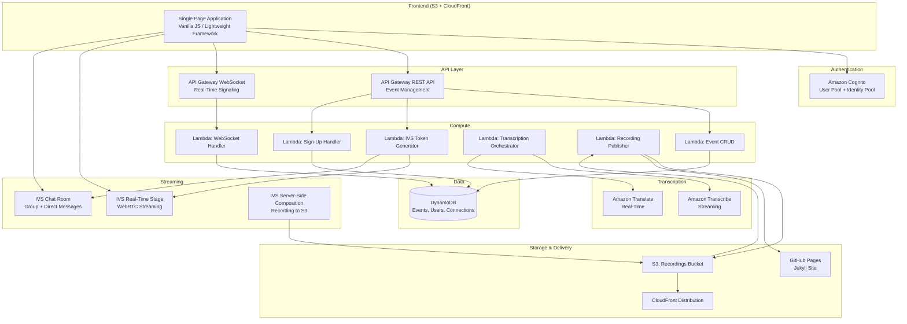
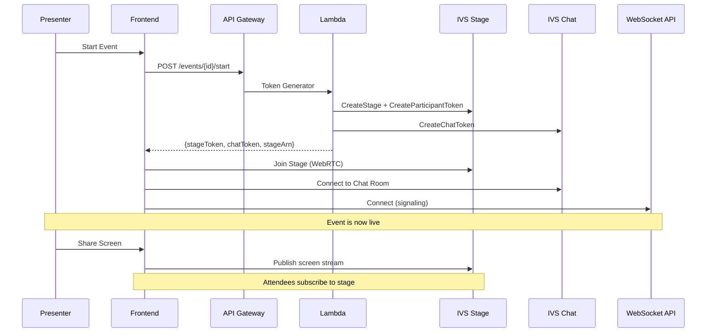
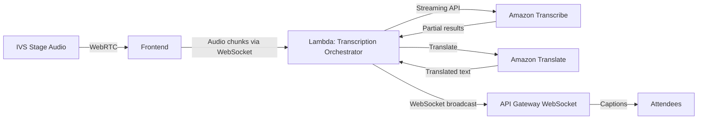
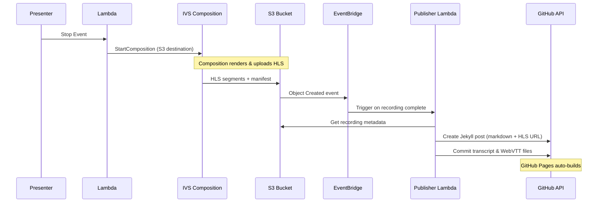
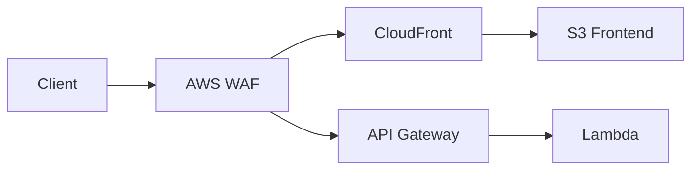
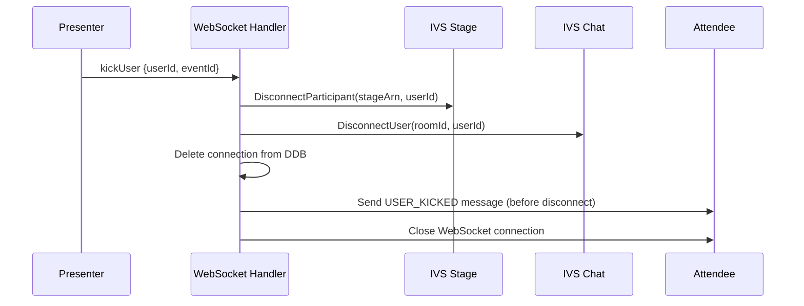
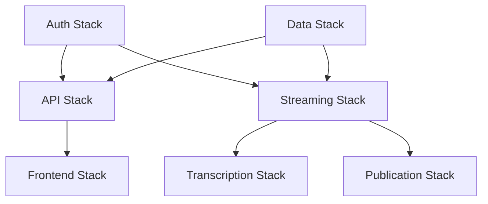

# Design Document: Virtual Meetup Platform

## Overview

The Virtual Meetup Platform is a serverless web application built on AWS that enables AWS user groups to host live meetup sessions with real-time streaming, interactive chat, Q&A, transcription/translation, and post-event recording publication. The system leverages Amazon IVS Real-Time Stages for sub-300ms latency WebRTC-based streaming, IVS Chat for messaging, API Gateway WebSocket for signaling/state, and a serverless backend (Lambda + DynamoDB) for all business logic.

### Branding & Visual Identity

The platform adopts the visual language of the AWS community ecosystem (User Groups, Community Builders, AWS Heroes) to feel like a natural extension of the AWS community experience.

**Design System**:
- **Primary color**: AWS Smile Orange (`#FF9900`) — used for CTAs, active states, highlights
- **Secondary color**: AWS Squid Ink (`#232F3E`) — used for headers, navigation, dark backgrounds
- **Accent colors**: AWS Cloud Blue (`#1B659D`), AWS Lime (`#7AA116`) for status indicators
- **Background**: Light mode default with `#FAFAFA` base, dark mode option with `#161E2D`
- **Typography**: Amazon Ember (or fallback: Inter/system sans-serif) — clean, modern, technical
- **Border radius**: 8px for cards, 4px for buttons — matches AWS console aesthetic
- **Shadows**: Subtle elevation (`0 2px 4px rgba(0,0,0,0.1)`) — flat but not completely flat

**Brand Elements**:
- Logo: Stylized community icon (people + cloud) in AWS Orange, with "AWS Community Meetups" wordmark
- Event cards styled like AWS service cards (icon + title + description + metadata)
- Navigation bar in Squid Ink with orange accent for active state
- "Powered by AWS" badge in footer
- Speaker/attendee avatars with orange ring for presenters, blue ring for community builders
- Status badges: Live (red pulse), Upcoming (orange), Ended (gray), Recording Available (green)

**Page Layouts**:
- **Event listing**: Grid of cards (similar to AWS workshop catalog or community.aws event pages)
- **Live session**: Dark theme (Squid Ink background) for reduced eye strain during presentations, with orange accents for interactive elements
- **Landing/sign-up page**: Hero section with event title, countdown, and community imagery
- **Waiting room**: Animated AWS-style loading with community tips/facts

**Responsive Design**: Mobile-first, breakpoints at 640px / 1024px / 1280px. Live session optimized for desktop but functional on tablet.

### Multi-Concurrent-Event Architecture

The platform is designed from the ground up to support multiple simultaneous events. Each event is fully isolated with its own IVS Stage, IVS Chat Room, and WebSocket connection namespace.

**Isolation Model**:
- Each event gets a dedicated IVS Stage (created on event start, destroyed on event end)
- Each event gets a dedicated IVS Chat Room (created on event creation, persists until deletion)
- WebSocket connections are namespaced by `eventId` — broadcasts only reach participants of that event
- DynamoDB items are partitioned by `EVENT#{eventId}` — no cross-event interference
- Server-Side Compositions are per-stage — recordings are independent

**Concurrent Event Handling**:
- Token generation Lambda handles requests for any event — stateless, event-scoped
- WebSocket signaling Lambda routes messages by `eventId` from the payload
- No shared mutable state between events (no global locks, no shared stages)
- Each event independently transitions through its lifecycle: `scheduled` → `live` → `ended` → `published`

**Scheduling Multiple Events**:
- Events can overlap in time — no scheduling conflict validation (intentional)
- A single organizer can run multiple events simultaneously (different browser tabs or co-presenters)
- The public event listing shows all upcoming events regardless of time overlap
- Attendees can only be in one live session at a time (frontend enforces, not backend)

**Resource Allocation per Event**:
| Resource | Per Event | Shared/Account-Wide |
|----------|-----------|---------------------|
| IVS Stage | 1 dedicated | Stages pool (1,000 max) |
| IVS Chat Room | 1 dedicated | Rooms pool (50,000 max) |
| WebSocket connections | N (per attendee) | Connection pool (3.6M max) |
| DynamoDB partition | 1 (EVENT#{id}) | Single table, auto-scales |
| S3 recording prefix | 1 (`recordings/{eventId}/`) | Shared bucket |
| Composition | 1 (on event end) | 20 concurrent max |
| Transcribe session | 1 (if enabled) | Account limit applies |

**Scaling to Many Concurrent Events** (if needed beyond defaults):
1. Request quota increase for concurrent subscriptions (20,000 → higher)
2. Request quota increase for concurrent publishers (1,000 → higher)
3. Stagger recording compositions or queue them via SQS if >20 events end simultaneously
4. Multi-region deployment for geographic distribution (IVS stages in multiple regions)

### Key Design Decisions

1. **Amazon IVS Real-Time (Stages)** over IVS Low-Latency: Stages support multi-participant WebRTC with <300ms latency, enabling co-presenters and attendee voice participation without a separate conferencing service.
2. **IVS Chat** for messaging: Native integration with IVS, supports chat rooms with moderation, direct messaging via custom events, and scales to thousands of concurrent users at no per-message cost.
3. **IVS Server-Side Composition** for recording: Combines all stage participants into a single HLS recording saved to S3, eliminating the need for MediaLive/MediaPackage for the recording pipeline.
4. **API Gateway WebSocket** for signaling: Manages hand-raising, question queue, role changes, and presence — lightweight state that doesn't need media-grade infrastructure.
5. **Amazon Cognito** for authentication: Serverless, cost-effective user pool with hosted UI for sign-up/sign-in.
6. **Amazon Transcribe Streaming** via WebSocket from a Lambda-backed service for real-time captions, with Amazon Translate for multi-language support.
7. **GitHub Pages + Jekyll** for recording publication: A Lambda function commits markdown posts and HLS URLs to a GitHub repository, triggering Jekyll builds automatically.

### Cost Optimization Strategy

- IVS Real-Time charges per participant-minute (no idle cost)
- IVS Chat is free for up to 3 chat rooms and 500 concurrent connections
- DynamoDB on-demand pricing (pay per request, no provisioned capacity)
- Lambda free tier covers most development/low-traffic usage
- S3 Intelligent-Tiering for recordings (auto-moves to cheaper storage)
- CloudFront free tier for initial playback traffic
- Cognito free tier covers up to 50,000 MAUs

## Capacity & Scalability Analysis

### User Capacity (per event)

Based on [IVS Real-Time service quotas](https://docs.aws.amazon.com/ivs/latest/RealTimeUserGuide/service-quotas.html):

| Resource | Default Quota | Adjustable | Impact |
|----------|--------------|------------|--------|
| Stage subscribers (viewers) | 10,000 per stage | Yes (up to 25,000) | Max attendees per event |
| Stage publishers (hosts) | 12 per stage | No | Max simultaneous presenters/speakers |
| Concurrent publishers (account) | 1,000 across all stages | Yes | Limits total speakers across all events |
| Concurrent subscriptions (account) | 20,000 across all stages | Yes | Limits total viewers across all events |
| Stages per region | 1,000 | Yes | Max concurrent events (theoretical) |
| Participant publish resolution | 720p | No | Max video quality |
| Participant publish/subscribe duration | 24 hours | No | Max event length |
| Participant download bitrate | 8.5 Mbps | No | Aggregate across all subscriptions |

**Per-Event Limits**:
- **Attendees (viewers)**: Up to 10,000 (default), 25,000 (with quota increase)
- **Presenters/Speakers**: Up to 12 simultaneously publishing
- **Event duration**: Up to 24 hours continuous

### Concurrent Event Capacity

| Constraint | Default | With Quota Increase | Bottleneck |
|-----------|---------|---------------------|------------|
| Stages per region | 1,000 | Higher (adjustable) | Not a concern |
| Concurrent publishers | 1,000 | Adjustable | If each event has 2 publishers → 500 concurrent events |
| Concurrent subscriptions | 20,000 | Adjustable | If each event has 40 viewers → 500 concurrent events |
| Compositions (recording) | 20 | Adjustable | Only 20 events can record simultaneously |
| IVS Chat rooms | 50,000 | Adjustable | Not a concern |
| Chat concurrent connections | 50,000 | Adjustable | If 40 per event → 1,250 concurrent events |
| API Gateway WebSocket connections | 3,600,000 | No | Not a concern |
| CreateParticipantToken API | 50 TPS | No | Burst join: 50 tokens/sec max |
| CreateStage API | 5 TPS | No | Max 5 events starting per second |

**Realistic Concurrent Event Capacity** (default quotas, 1 presenter + 40 attendees each):
- **Publishers**: 1,000 ÷ 1 = 1,000 events (not all attendees publish)
- **Subscriptions**: 20,000 ÷ 40 = 500 events
- **Compositions**: 20 concurrent recordings (stagger event end times)
- **Effective limit**: ~500 concurrent events (subscription-bound)

**For your use case** (AWS user groups, likely 1-5 concurrent events): Well within all default quotas. No quota increases needed.

### Scaling Considerations

| Scenario | Mitigation |
|----------|-----------|
| Token burst at event start (41 users joining) | CreateParticipantToken at 50 TPS handles this in <1 second |
| Chat message burst | 100 messages/sec per room (configurable), 1,000/sec across all rooms |
| WebSocket broadcast to 40 connections | Lambda fans out via API Gateway Management API — trivial |
| DynamoDB hot partition (popular event) | Single-table design with eventId partition — 40 users won't cause throttling |
| Multiple events ending simultaneously | Composition limit of 20 — stagger or queue recordings |

## Cost Estimate

### Scenario: 90-Minute Event, 1 Presenter, 40 Attendees, All Features (North America)

#### Real-Time Event Cost

| Service | Calculation | Cost |
|---------|-------------|------|
| **IVS Real-Time (Presenter)** | 1 host × 1.5 hrs × $0.072/hr | $0.108 |
| **IVS Real-Time (Attendees)** | 40 viewers × 1.5 hrs × $0.072/hr | $4.320 |
| **IVS Server-Side Composition (HD recording)** | 1.5 hrs × $0.30/hr | $0.450 |
| **IVS Chat (messages sent)** | ~500 messages × ($0.56/1M) | $0.000280 |
| **IVS Chat (messages delivered)** | 500 msgs × 41 recipients × ($0.008/1M) | $0.000164 |
| **Amazon Transcribe Streaming** | 90 min × $0.024/min | $2.160 |
| **Amazon Translate** | ~15,000 words × 5 chars × ($15/1M chars) | $1.125 |
| **API Gateway WebSocket (messages)** | ~5,000 msgs × ($1.00/1M) | $0.005 |
| **API Gateway WebSocket (connection min)** | 41 × 90 min × ($0.25/1M min) | $0.001 |
| **API Gateway HTTP API (REST calls)** | ~200 calls × ($1.00/1M) | $0.000200 |
| **Lambda invocations** | ~5,500 invocations × ($0.20/1M) | $0.001 |
| **Lambda compute** | ~5,500 × 200ms × 256MB × ($0.0000166667/GB-s) | $0.005 |
| **DynamoDB (writes)** | ~600 WRU × ($1.25/1M) | $0.001 |
| **DynamoDB (reads)** | ~2,000 RRU × ($0.25/1M) | $0.001 |
| **S3 storage (recording ~2GB)** | 2 GB × $0.023/GB | $0.046 |
| **CloudFront (live delivery)** | Included in IVS pricing | $0.00 |
| | | |
| **Total per 90-min event** | | **~$8.22** |

#### Playback Cost (per viewer watching 90-min recording)

| Service | Calculation | Cost |
|---------|-------------|------|
| **CloudFront data transfer** | ~1.5 GB × $0.085/GB | $0.128 |
| **S3 GET requests** | ~500 segment requests × ($0.0004/1K) | $0.0002 |
| | | |
| **Total per playback viewer** | | **~$0.13** |

*Example: 100 people watch the recording = ~$13 playback cost*

#### Monthly Steady-State Cost (no events running)

| Service | Calculation | Cost/Month |
|---------|-------------|------------|
| **S3 storage** (10 recordings × 2GB) | 20 GB × $0.023/GB | $0.46 |
| **DynamoDB** (on-demand, minimal reads) | ~10,000 RRU + 1,000 WRU | $0.004 |
| **CloudFront** (landing page, ~1000 visits) | Minimal transfer | $0.10 |
| **Cognito** (< 50,000 MAU) | Free tier | $0.00 |
| **Lambda** (< 1M invocations) | Free tier | $0.00 |
| **API Gateway** (< 1M calls) | Free tier | $0.00 |
| **Route 53** (optional custom domain) | 1 hosted zone | $0.50 |
| | | |
| **Total monthly steady-state** | | **~$1.06** |

#### Monthly Cost Summary (4 events/month, 40 attendees each)

| Category | Cost |
|----------|------|
| 4 live events | $32.88 |
| Playback (200 total views) | $26.00 |
| Steady-state infrastructure | $1.06 |
| **Total monthly estimate** | **~$60** |

*Note: First 12 months with AWS Free Tier would reduce this significantly (20 free participant hours, 60 free Transcribe minutes, free Lambda/DynamoDB/API Gateway tier).*

#### Cost Optimization Tips

1. **Skip translation** if not needed → saves ~$1.13/event
2. **Use audio-only for attendees** who don't need video → $0.0072/hr (1/10th cost) instead of $0.072/hr
3. **Disable transcription** for informal events → saves $2.16/event
4. **S3 Intelligent-Tiering** for old recordings → auto-moves to cheaper storage after 30 days
5. **Limit recording resolution to SD** → $0.15/hr instead of $0.30/hr for composition

### Diagram Generation

The platform will include a CDK construct that generates an architecture diagram as part of the deployment pipeline. The implementation will use the `cdk-dia` package or a custom script that:

1. Reads the CDK CloudFormation template output
2. Generates a visual architecture diagram (SVG/PNG) using the Mermaid diagrams defined in this document
3. Publishes the diagram to the GitHub Pages site alongside documentation

**Implementation approach**: A post-deployment Lambda or local script that renders the Mermaid diagrams in this document to PNG/SVG using `@mermaid-js/mermaid-cli` (mmdc). The generated diagrams are committed to the GitHub Pages repo for public documentation.

**Diagrams to generate**:
- High-level architecture (services and connections)
- Data flow diagram (event lifecycle)
- Streaming pipeline diagram
- Recording/publication pipeline

These are already defined as Mermaid code blocks in this document and can be rendered during CI/CD or as a CDK custom resource.

## Architecture

### High-Level Architecture Diagram



### Component Interaction Flow



## Components and Interfaces

### 1. Frontend Application

**Technology**: Vanilla JavaScript SPA hosted on S3 + CloudFront

**Key Libraries**:
- `amazon-ivs-web-broadcast` SDK for IVS Real-Time stage participation
- `amazon-ivs-chat-messaging` SDK for chat
- `hls.js` for recording playback
- Cognito SDK (`amazon-cognito-identity-js`) for auth

**Pages**:
| Page | Route | Auth Required |
|------|-------|---------------|
| Public Event List | `/` | No |
| Event Landing/Sign-Up | `/events/:id` | No |
| Waiting Room | `/events/:id/waiting` | No |
| Live Session | `/events/:id/live` | No (view), Yes (interact) |
| Event Management | `/manage` | Yes |
| Recording Playback | External (GitHub Pages) | No |

### 2. REST API (API Gateway HTTP API)

| Method | Path | Lambda | Description |
|--------|------|--------|-------------|
| POST | `/events` | EventCRUD | Create event |
| GET | `/events` | EventCRUD | List upcoming events |
| GET | `/events/{id}` | EventCRUD | Get event details |
| PUT | `/events/{id}` | EventCRUD | Update event |
| DELETE | `/events/{id}` | EventCRUD | Delete event |
| POST | `/events/{id}/start` | SessionManager | Start event, create IVS resources |
| POST | `/events/{id}/stop` | SessionManager | Stop event, trigger recording |
| POST | `/events/{id}/join` | TokenGenerator | Get participant token for stage + chat |
| POST | `/events/{id}/signup` | SignUpHandler | Register for event |
| GET | `/events/{id}/signups` | SignUpHandler | List sign-ups (organizer only) |

**Authorization**: Cognito User Pool Authorizer on protected endpoints. Public endpoints (GET /events, GET /events/{id}) require no auth.

### 3. WebSocket API (API Gateway WebSocket)

**Routes**:
| Route | Handler | Description |
|-------|---------|-------------|
| `$connect` | WSConnect | Authenticate, store connection in DDB |
| `$disconnect` | WSDisconnect | Remove connection from DDB |
| `raiseHand` | WSSignaling | Attendee raises hand |
| `lowerHand` | WSSignaling | Attendee/Presenter lowers hand |
| `lowerAllHands` | WSSignaling | Presenter lowers all hands |
| `submitQuestion` | WSSignaling | Attendee submits question |
| `answerQuestion` | WSSignaling | Presenter marks question answered |
| `dismissQuestion` | WSSignaling | Presenter dismisses question |
| `promoteUser` | WSSignaling | Presenter promotes to co-presenter |
| `demoteUser` | WSSignaling | Presenter demotes co-presenter |
| `grantSpeak` | WSSignaling | Presenter grants speaking permission |
| `revokeSpeak` | WSSignaling | Presenter revokes speaking permission |
| `toggleChat` | WSSignaling | Presenter enables/disables group chat |
| `eventStateUpdate` | WSSignaling | Broadcast event state changes |

**Message Format** (client → server):
```json
{
  "action": "raiseHand",
  "eventId": "evt_abc123",
  "data": {}
}
```

**Message Format** (server → client):
```json
{
  "type": "HAND_RAISED",
  "eventId": "evt_abc123",
  "data": {
    "userId": "user_xyz",
    "displayName": "Jane",
    "timestamp": "2024-01-15T10:30:00Z"
  }
}
```

### 4. IVS Real-Time Stage Management

**Stage Lifecycle**:
1. Presenter starts event → Lambda creates IVS Stage
2. Lambda generates participant tokens with appropriate capabilities:
   - Presenter: `PUBLISH` + `SUBSCRIBE`
   - Co-Presenter: `PUBLISH` + `SUBSCRIBE`
   - Attendee (speaking): `PUBLISH` + `SUBSCRIBE`
   - Attendee (viewing): `SUBSCRIBE` only
3. Frontend uses IVS Web Broadcast SDK to join stage
4. On event end → Lambda starts Server-Side Composition for recording → stops stage

**Token Generation Logic**:
```javascript
// Pseudocode for token generation
const capabilities = role === 'presenter' || role === 'co-presenter'
  ? ['PUBLISH', 'SUBSCRIBE']
  : hasSpeakPermission
    ? ['PUBLISH', 'SUBSCRIBE']
    : ['SUBSCRIBE'];

const token = await ivsRealTime.createParticipantToken({
  stageArn,
  userId,
  capabilities,
  duration: 720 // 12 hours max
});
```

### 5. IVS Chat Integration

**Chat Room per Event**: One IVS Chat Room created per event. Tokens generated with capabilities based on role and chat state.

**Message Types** (via IVS Chat custom events):
- `GROUP_MESSAGE`: Standard group chat message
- `DIRECT_MESSAGE`: Private message to presenter (sent as custom event with target)
- `SYSTEM_NOTIFICATION`: Role changes, question status updates

**Chat Moderation**:
- Presenter can disable group chat by sending a `CHAT_DISABLED` event
- Frontend respects this state and blocks message input
- Direct messages to presenter always allowed

### 6. Transcription Service

**Architecture**:


**Alternative (Cost-Optimized) Approach**: 
The frontend captures the audio from the IVS stage subscription, sends PCM audio chunks to a dedicated WebSocket endpoint. A long-running Lambda (up to 15 min) or ECS Fargate task maintains the Transcribe Streaming session. Results are broadcast back via the signaling WebSocket.

For cost optimization, we use a **browser-side approach**: The presenter's browser sends audio directly to Amazon Transcribe via its WebSocket streaming API (using pre-signed URLs generated by Lambda). Transcription results flow back to the presenter's browser, which then broadcasts them via IVS Chat custom events to all attendees. This eliminates the need for a server-side audio relay.

### 7. Recording & Publication Pipeline



**Recording Storage Structure** (S3):
```
recordings/
  {eventId}/
    media/
      master.m3u8
      *.ts (segments)
    thumbnails/
      thumb_001.jpg
    metadata.json
    transcript.txt
    captions.vtt
```

### 8. Authentication (Amazon Cognito)

**User Pool Configuration**:
- Sign-up with email verification
- Custom attributes: `custom:role` (organizer | member)
- App client with SRP auth flow (no client secret for SPA)

**Authorization Model**:
| Action | Required Role |
|--------|--------------|
| Create/Edit/Delete Event | organizer |
| Start/Stop Event | organizer (event owner) |
| Join as Presenter | organizer (event owner) or promoted |
| Join as Attendee | any authenticated or anonymous |
| View public events | none |

**Token Flow**:
1. User authenticates via Cognito Hosted UI or SDK
2. Frontend receives ID token + Access token
3. Access token sent in `Authorization` header to REST API
4. WebSocket connection authenticated via query string token on `$connect`
5. IVS stage/chat tokens generated server-side using Cognito identity

## Data Models

### DynamoDB Table Design

**Single-Table Design** with a primary table and GSIs for access patterns.

#### Table: `VirtualMeetupTable`

**Primary Key**: `PK` (Partition Key), `SK` (Sort Key)

| Entity | PK | SK | Attributes |
|--------|----|----|------------|
| Event | `EVENT#{eventId}` | `METADATA` | title, description, scheduledStart, status, ownerUserId, ivsStageArn, ivsChatRoomArn, hlsPlaybackUrl, createdAt, updatedAt |
| Event Sign-Up | `EVENT#{eventId}` | `SIGNUP#{userId}` | userId, displayName, email, registeredAt |
| User | `USER#{userId}` | `PROFILE` | email, displayName, role, cognitoSub, createdAt |
| Connection | `EVENT#{eventId}` | `CONN#{connectionId}` | userId, connectionId, role, joinedAt, hasSpeakPermission |
| Hand Raised | `EVENT#{eventId}` | `HAND#{timestamp}#{userId}` | userId, displayName, raisedAt |
| Question | `EVENT#{eventId}` | `QUESTION#{timestamp}#{questionId}` | questionId, userId, displayName, text, status (queued/answered/dismissed), submittedAt |
| Recording | `EVENT#{eventId}` | `RECORDING` | s3Bucket, s3Prefix, hlsUrl, cloudfrontUrl, transcriptUrl, captionUrl, duration, publishedAt |

#### Global Secondary Indexes

| GSI Name | PK | SK | Purpose |
|----------|----|----|---------|
| GSI1 | `GSI1PK` | `GSI1SK` | List upcoming events by start time |
| GSI2 | `GSI2PK` | `GSI2SK` | List events by owner |

**GSI1 Access Pattern** (upcoming events):
- `GSI1PK`: `EVENTS#UPCOMING`
- `GSI1SK`: `{scheduledStart}#{eventId}`
- Query: `GSI1PK = "EVENTS#UPCOMING"` with `GSI1SK > now()`

**GSI2 Access Pattern** (events by owner):
- `GSI2PK`: `USER#{userId}#EVENTS`
- `GSI2SK`: `{scheduledStart}#{eventId}`

#### Connection Table: `WebSocketConnections`

Separate table for WebSocket connection management (high write throughput, TTL cleanup):

| PK | SK | Attributes |
|----|----|------------|
| `connectionId` | `connectionId` | eventId, userId, role, connectedAt, ttl |

**GSI**: `EventConnections` — PK: `eventId`, SK: `connectionId` (for broadcasting to all connections in an event)

### Data Flow Examples

**Create Event**:
```json
{
  "PK": "EVENT#evt_abc123",
  "SK": "METADATA",
  "GSI1PK": "EVENTS#UPCOMING",
  "GSI1SK": "2024-03-15T18:00:00Z#evt_abc123",
  "GSI2PK": "USER#user_xyz#EVENTS",
  "GSI2SK": "2024-03-15T18:00:00Z#evt_abc123",
  "title": "AWS Lambda Deep Dive",
  "description": "Learn advanced Lambda patterns",
  "scheduledStart": "2024-03-15T18:00:00Z",
  "status": "scheduled",
  "ownerUserId": "user_xyz",
  "createdAt": "2024-03-01T10:00:00Z"
}
```

**Event Status Values**: `scheduled` → `live` → `ended` → `published`


## Correctness Properties

*A property is a characteristic or behavior that should hold true across all valid executions of a system — essentially, a formal statement about what the system should do. Properties serve as the bridge between human-readable specifications and machine-verifiable correctness guarantees.*

### Property 1: Hand Lowering Removes Specific Hand

*For any* event with N raised hands (N > 0), when the presenter lowers a specific attendee's hand, the raised-hand list should contain exactly N-1 entries and the lowered attendee's hand should not be present.

**Validates: Requirements 5.1**

### Property 2: Lower All Hands Clears All

*For any* event with N raised hands (N ≥ 0), when the presenter lowers all hands, the raised-hand list should be empty (length 0) and exactly N notifications should be generated.

**Validates: Requirements 5.2**

### Property 3: Direct Messages Delivered Only to Presenter

*For any* event with M participants (M > 1), when an attendee sends a direct message, the message should be delivered to exactly one recipient (the presenter) and no other participant should receive it.

**Validates: Requirements 6.2, 10.1**

### Property 4: Messages Displayed in Chronological Order

*For any* sequence of messages with timestamps, the displayed message list should be sorted in non-decreasing order of timestamp — i.e., for all adjacent messages (m_i, m_{i+1}), timestamp(m_i) ≤ timestamp(m_{i+1}).

**Validates: Requirements 6.3, 9.2**

### Property 5: Role Promotion/Demotion Round-Trip

*For any* attendee in an event, promoting them to co-presenter and then demoting them back should result in the user having exactly the same capabilities as a standard attendee (SUBSCRIBE only, no moderation privileges).

**Validates: Requirements 7.1, 7.2**

### Property 6: Question Queue Maintains Submission Order

*For any* sequence of questions submitted to an event, the question queue should maintain FIFO order — questions submitted earlier always appear before questions submitted later.

**Validates: Requirements 8.1, 13.1**

### Property 7: Answered or Dismissed Questions Removed from Active Queue

*For any* question in the active queue, marking it as answered or dismissed should remove it from the active queue, and the remaining questions should preserve their relative order.

**Validates: Requirements 8.2, 8.3**

### Property 8: Chat Permission Controls Message Acceptance

*For any* attendee group message attempt, the message is accepted if and only if group chat is currently enabled by the presenter. When disabled, the message is rejected and the attendee receives a "disabled" notification.

**Validates: Requirements 9.1, 9.3**

### Property 9: Speaking Permission Controls Audio Transmission

*For any* attendee, their microphone audio is transmitted to other participants if and only if the presenter has granted them speaking permission. Without permission, audio input is muted.

**Validates: Requirements 11.1, 11.3**

### Property 10: Hand Raise/Lower Round-Trip

*For any* attendee, raising their hand and then lowering it should result in the attendee not appearing in the raised-hand list — the list returns to its state before the raise.

**Validates: Requirements 12.1, 12.2**

### Property 11: Raised Hands Ordered by Time

*For any* set of raised hands in an event, the displayed order should be sorted by raise timestamp — hands raised earlier appear first.

**Validates: Requirements 12.3**

### Property 12: Event Creation Produces Unique URL with All Metadata

*For any* valid event creation input (title, description, future start time), the created event should have a unique URL (different from all other events) and store all provided metadata fields.

**Validates: Requirements 14.1**

### Property 13: Past Start Time Rejected

*For any* event creation request where the scheduled start time is in the past (relative to current time), the creation should be rejected with a validation error.

**Validates: Requirements 14.3**

### Property 14: Event URL Preserved Across Edits

*For any* event, editing its metadata (title, description, start time) should not change its URL. The URL before and after the edit should be identical.

**Validates: Requirements 18.2**

### Property 15: Authentication Required for Protected Operations

*For any* request to create, edit, or delete an event that lacks a valid authentication token, the request should be rejected with an authorization error.

**Validates: Requirements 18.1**

### Property 16: Deleted Events Removed from Public Listing

*For any* event that has been deleted, it should not appear in the public upcoming events list.

**Validates: Requirements 18.3**

### Property 17: Upcoming Event List Contains Only Future Non-Ended Events, Sorted

*For any* query of the upcoming events list, all returned events should have status "scheduled" and a start time in the future, and the list should be sorted by scheduled start time in ascending order.

**Validates: Requirements 17.1, 17.3**

### Property 18: Event List Contains All Required Fields

*For any* event in the public listing, the rendered output should include the event title, description, scheduled start time, and a link to the landing page.

**Validates: Requirements 17.2**

### Property 19: Event State Determines Landing Page Display Mode

*For any* event, if its status is "scheduled" (not started), the landing page shows a sign-up form; if its status is "live" or "ended", the landing page shows the current status instead of the form.

**Validates: Requirements 15.3**

### Property 20: Playback Page Contains Required Content

*For any* completed recording with associated transcript, the generated playback page should contain the HLS playback URL, event metadata (title, description, date), and a reference to the WebVTT caption file.

**Validates: Requirements 21.2, 22.3**

### Property 21: WebVTT Generation from Transcription Segments

*For any* set of transcription segments (each with start time, end time, and text), the generated WebVTT file should be valid WebVTT format with all segments represented as cues in chronological order.

**Validates: Requirements 22.1**

### Property 22: Sign-Up Registers User for Event

*For any* valid sign-up submission (with email and name) for a scheduled event, the user should appear in the event's sign-up list after registration.

**Validates: Requirements 15.2**

## Abuse Prevention & Security

### DDoS and Rate Limiting

**AWS WAF** deployed on CloudFront and API Gateway (both REST and WebSocket):



**WAF Rules**:
| Rule | Scope | Threshold | Action |
|------|-------|-----------|--------|
| IP Rate Limit (unauth) | All unauthenticated endpoints | 100 req/min per IP | Block for 5 min |
| IP Rate Limit (auth) | All authenticated endpoints | 500 req/min per IP | Block for 5 min |
| Bot Control | CloudFront | AWS Managed Rule | Challenge/Block |
| SQL Injection | All endpoints | AWS Managed Rule | Block |
| XSS | All endpoints | AWS Managed Rule | Block |
| Size Restriction | Chat/WebSocket | Max 4KB payload | Block |

**AWS Shield Standard**: Automatically enabled on CloudFront and API Gateway — provides protection against SYN floods, UDP reflection, and other volumetric attacks at no additional cost.

**WebSocket Connection Limits**: API Gateway enforces max idle timeout (10 min) and max connection duration (2 hours). TTL on DynamoDB connection records auto-cleans stale entries.

### User Moderation — Kick and Ban

**Data Model Addition**:
| Entity | PK | SK | Attributes |
|--------|----|----|------------|
| Ban | `EVENT#{eventId}` | `BAN#{userId}` | userId, displayName, bannedBy, reason, bannedAt |

**Kick Flow**:


**Ban Flow**: Same as kick, plus writes a `BAN#{userId}` item to DynamoDB. All subsequent `join` requests check the ban list before issuing tokens.

**Ban Check** (in Token Generator Lambda):
```javascript
// Before generating tokens, check ban list
const banItem = await ddb.get({
  TableName: TABLE_NAME,
  Key: { PK: `EVENT#${eventId}`, SK: `BAN#${userId}` }
});
if (banItem.Item) {
  return { statusCode: 403, body: JSON.stringify({ error: 'You are banned from this event' }) };
}
```

**WebSocket Routes Added**:
| Route | Handler | Description |
|-------|---------|-------------|
| `kickUser` | WSSignaling | Disconnect user from all services |
| `banUser` | WSSignaling | Kick + add to ban list |
| `unbanUser` | WSSignaling | Remove from ban list |
| `muteAudio` | WSSignaling | Mute specific attendee's audio |
| `muteVideo` | WSSignaling | Disable specific attendee's video |
| `restrictChat` | WSSignaling | Block attendee from sending messages |
| `restrictQuestions` | WSSignaling | Block attendee from submitting questions |
| `globalMuteAudio` | WSSignaling | Mute all attendees' audio |
| `globalMuteVideo` | WSSignaling | Disable all attendees' video |

### Authenticated Participation

**Authentication Tiers**:
| Action | Auth Required | Verification Required |
|--------|--------------|----------------------|
| View public event listing | No | No |
| View landing page | No | No |
| View live stream (subscribe-only) | Yes | Yes (email verified) |
| Chat, raise hand, ask questions | Yes | Yes (email verified) |
| Speak (with permission) | Yes | Yes (email verified) |
| Present / co-present | Yes | Yes (email verified) |
| Manage events | Yes | Yes (email verified + organizer role) |

**Cognito Anti-Abuse Configuration**:
- Email verification required before any interactive action
- Advanced Security Features enabled: adaptive authentication, compromised credential detection
- CAPTCHA challenge on sign-up (via Cognito hosted UI or custom challenge Lambda)
- Account lockout after 5 failed sign-in attempts (temporary, 15 min)
- Admin can disable accounts (sets `Enabled: false` on user pool record)

**Token Issuance Gate**: The Token Generator Lambda verifies:
1. Valid Cognito access token (not expired, not revoked)
2. Email is verified (`email_verified: true` claim)
3. User is not banned from the event
4. User account is enabled

### File Transfer Prevention

**Enforcement Points**:
1. **IVS Chat Message Review Handler**: Lambda-based message review that rejects messages with binary content or file attachment indicators
2. **Chat message validation** (in WebSocket handler): Reject messages exceeding 500 characters or containing base64-encoded data patterns
3. **No upload endpoints**: The API has no file upload routes — no S3 pre-signed URLs for user content
4. **URL blocklist**: Configurable list of file-sharing domain patterns (stored in DynamoDB or environment variable) — messages containing matching URLs are rejected
5. **Content-Type enforcement**: WebSocket and Chat only accept `text/plain` message content

**IVS Chat Message Review Handler** (Lambda):
```javascript
// Attached to IVS Chat Room as message review handler
exports.handler = async (event) => {
  const { content, attributes } = event;
  
  // Reject binary/file content
  if (content.length > 500) return { allow: false, reason: 'Message too long' };
  if (/data:[a-z]+\/[a-z]+;base64,/i.test(content)) return { allow: false, reason: 'File content not allowed' };
  if (blockedUrlPatterns.some(p => p.test(content))) return { allow: false, reason: 'File sharing links not allowed' };
  
  return { allow: true };
};
```

### Presenter Mute and Participation Controls

**Mute/Restrict State** (stored on connection record in DynamoDB):
| Field | Type | Default | Description |
|-------|------|---------|-------------|
| `audioMuted` | Boolean | false | Presenter has muted this attendee's audio |
| `videoDisabled` | Boolean | false | Presenter has disabled this attendee's video |
| `chatRestricted` | Boolean | false | Presenter has blocked this attendee from chatting |
| `questionsRestricted` | Boolean | false | Presenter has blocked this attendee from asking questions |

**Enforcement**:
- **Audio mute**: WebSocket sends `AUDIO_MUTED` to attendee's client → client stops publishing audio track. Server-side: if attendee ignores client instruction, IVS `DisconnectParticipant` + re-issue token with SUBSCRIBE-only capabilities.
- **Video disable**: Same pattern — client stops publishing video track, server enforces via token reissuance if needed.
- **Chat restrict**: WebSocket handler checks `chatRestricted` flag before accepting messages. IVS Chat message review handler also checks user's restriction status.
- **Question restrict**: WebSocket handler checks `questionsRestricted` flag before accepting `submitQuestion` actions.
- **Screen share prevention**: Token Generator NEVER issues PUBLISH capability to non-promoted attendees. Only presenters and co-presenters get PUBLISH tokens. This is enforced server-side — client cannot bypass.

**Global Mute**: Sets a flag on the event metadata (`globalAudioMute: true`, `globalVideoMute: true`). All message handlers check this flag in addition to per-user flags.

## Observability & Metrics

### Structured Logging

All Lambda functions use a shared logging utility that emits structured JSON:

```javascript
// cdk/lambda/shared/logger.js
const log = (level, message, context = {}) => {
  console.log(JSON.stringify({
    timestamp: new Date().toISOString(),
    level,
    message,
    requestId: context.requestId || process.env.AWS_REQUEST_ID,
    eventId: context.eventId,
    userId: context.userId,
    action: context.action,
    duration: context.duration,
    error: context.error,
    ...context.extra
  }));
};
module.exports = { info: (m, c) => log('INFO', m, c), error: (m, c) => log('ERROR', m, c), warn: (m, c) => log('WARN', m, c) };
```

**Log Retention**: 30 days for all Log Groups (set via CDK `logRetention` property).

**Correlation**: API Gateway request ID passed through to Lambda via `event.requestContext.requestId`, included in all log entries and downstream calls.

**State Transitions Logged**: event start/stop, user join/leave, role changes (promote/demote), kicks/bans, recording start/complete, transcription start/stop, publication success/failure.

### CloudWatch Dashboard

**Dashboard Name**: `VirtualMeetupPlatform-{env}`

**Widgets**:
| Widget | Metric Source | Type |
|--------|--------------|------|
| API Latency (p50/p95/p99) | API Gateway | Line graph |
| API Error Rate (4xx/5xx) | API Gateway | Line graph + alarm annotation |
| Lambda Duration by Function | Lambda | Stacked area |
| Lambda Errors & Throttles | Lambda | Bar chart |
| WebSocket Active Connections | Custom metric (from DDB count) | Number |
| DynamoDB Consumed RCU/WCU | DynamoDB | Line graph |
| IVS Stage Participants | Custom metric | Number |
| Live Events Count | Custom metric | Number |
| Chat Messages/min | Custom metric | Line graph |
| Questions Submitted/min | Custom metric | Line graph |

### CloudWatch Alarms

| Alarm | Condition | Period | Action |
|-------|-----------|--------|--------|
| High API Error Rate | 5xx rate > 5% | 5 min | SNS notification |
| Lambda Errors | Error rate > 1% | 5 min | SNS notification |
| DynamoDB Throttling | ThrottledRequests > 0 | 1 min | SNS notification |
| WebSocket Failures | Connection errors > 10/min | 1 min | SNS notification |
| High Lambda Duration | p99 > 5s | 5 min | SNS notification |
| Recording Failure | Composition errors > 0 | 5 min | SNS notification |

**SNS Topic**: `VirtualMeetupAlarms-{env}` — subscribers configured via CDK context (email addresses, Slack webhook via Lambda subscription).

### CloudWatch Logs Insights Saved Queries

```
# Error search across all functions
fields @timestamp, @message
| filter level = "ERROR"
| sort @timestamp desc
| limit 100

# Slow Lambda invocations (>3s)
fields @timestamp, @duration, @requestId, action
| filter @duration > 3000
| sort @duration desc

# WebSocket disconnection patterns
fields @timestamp, userId, eventId, action
| filter action = "disconnect"
| stats count() by bin(5m)

# Failed authentication attempts
fields @timestamp, userId, action, error
| filter action = "authenticate" and level = "ERROR"
| sort @timestamp desc
```

### Custom Metrics (CloudWatch EMF)

Using [CloudWatch Embedded Metric Format](https://docs.aws.amazon.com/AmazonCloudWatch/latest/monitoring/CloudWatch_Embedded_Metric_Format.html) for zero-cost metric emission from Lambda:

**Namespace**: `VirtualMeetup/{env}`

**Per-Event Engagement Metrics** (dimensions: `eventId`):
| Metric | Unit | Emitted On |
|--------|------|-----------|
| `AttendeeCount` | Count | User join/leave |
| `PeakConcurrentAttendees` | Count | Periodic (every 30s during event) |
| `ChatMessagesSent` | Count | Each message |
| `QuestionsSubmitted` | Count | Each question |
| `HandRaises` | Count | Each hand raise |
| `CoPresenterPromotions` | Count | Each promotion |
| `SessionDuration` | Seconds | User leave |
| `KicksIssued` | Count | Each kick |
| `BansIssued` | Count | Each ban |

**Media Performance Metrics** (dimensions: `eventId`, `participantId`):
| Metric | Unit | Source |
|--------|------|--------|
| `VideoBitrate` | Bits/Second | IVS Stage events (via EventBridge) |
| `AudioBitrate` | Bits/Second | IVS Stage events |
| `FramesPerSecond` | Count/Second | IVS Stage events |
| `PacketLoss` | Percent | IVS Stage events |
| `ConnectionQuality` | None (enum) | IVS Stage events |

**IVS Metrics Integration**: IVS publishes participant events to EventBridge. A Lambda subscriber captures these and emits them as CloudWatch custom metrics. Available metrics from IVS include connection state changes, quality indicators, and participant join/leave events.

### Per-Event Engagement Summary (DynamoDB)

Stored as `EVENT#{eventId}` / `METRICS` in the main table:

```json
{
  "PK": "EVENT#evt_abc123",
  "SK": "METRICS",
  "totalAttendees": 42,
  "peakConcurrent": 38,
  "totalChatMessages": 156,
  "totalQuestions": 12,
  "totalHandRaises": 8,
  "avgSessionDurationSec": 4820,
  "coPresenterPromotions": 2,
  "totalKicks": 0,
  "totalBans": 0,
  "avgVideoBitrateKbps": 2500,
  "avgAudioBitrateKbps": 128,
  "avgFps": 30,
  "recordingDurationSec": 5400,
  "updatedAt": "2024-03-15T19:30:00Z"
}
```

Updated incrementally during the event (atomic counters via DynamoDB `ADD` operations). Finalized on event end.

### Public Usage Display

**Live Event**: Real-time attendee count broadcast via WebSocket every 5 seconds (or on join/leave). Displayed as a badge on the live session UI.

**Past Event (Playback Page)**: Engagement summary pulled from DynamoDB `METRICS` record and rendered on the recording page:
- Total attendees
- Peak concurrent
- Total messages
- Total questions
- Event duration

**Leaderboard** (public event listing page): Events sorted by total attendees or engagement score. Engagement score = `totalAttendees + (totalChatMessages * 0.5) + (totalQuestions * 2)`. Displayed as a "Most Popular" section on the homepage.

### Load Testing

**Tool**: Custom Node.js load testing script using `ws` (WebSocket client) and `undici` (HTTP client). No heavy framework — keeps it simple and cheap.

**Architecture**:
```
scripts/
  load-test/
    index.js          # Orchestrator — spawns virtual users
    virtual-user.js   # Simulates single attendee lifecycle
    scenarios/
      join-and-watch.js    # Join, subscribe, idle, leave
      active-participant.js # Join, chat, raise hand, ask questions, leave
      presenter.js          # Start event, publish, manage, stop
    config.js         # Target URLs, credentials, ramp-up settings
    report.js         # Collects and prints latency/error stats
```

**Virtual User Behavior** (active-participant scenario):
1. Authenticate via Cognito (get tokens)
2. POST /events/{id}/join (get IVS + chat tokens)
3. Connect WebSocket (signaling)
4. Send 2-5 chat messages (random intervals)
5. Raise hand once
6. Submit 1 question
7. Stay connected for 5-15 minutes (configurable)
8. Disconnect

**Metrics Collected**:
- Join latency (token request → WebSocket connected)
- Chat message round-trip (send → receive broadcast)
- API response times (p50, p95, p99)
- WebSocket message delivery latency
- Error count by type
- Concurrent connection count over time

**Ramp-Up**: Linear ramp from 0 to N users over T seconds (configurable). Default: 100 users over 60 seconds.

**Output**: Console report + optional JSON file for CI integration. Example:
```
Load Test Results (100 users, 5 min duration)
─────────────────────────────────────────────
Join Latency:    p50=320ms  p95=890ms  p99=1200ms
Chat RTT:        p50=45ms   p95=120ms  p99=250ms
API (GET):       p50=80ms   p95=200ms  p99=450ms
API (POST):      p50=150ms  p95=400ms  p99=800ms
WebSocket Msg:   p50=30ms   p95=90ms   p99=180ms
Errors:          0 (0.00%)
Peak Concurrent: 98
```

## Error Handling

### Error Categories and Responses

| Category | Error | HTTP Status | User-Facing Message | Recovery |
|----------|-------|-------------|---------------------|----------|
| Auth | Missing/invalid token | 401 | "Please sign in to continue" | Redirect to Cognito login |
| Auth | Insufficient permissions | 403 | "You don't have permission for this action" | Show current role |
| Validation | Past start time | 400 | "Event start time must be in the future" | Highlight field |
| Validation | Missing required fields | 400 | "Please fill in all required fields" | Highlight fields |
| Media | Screen share denied | N/A (client) | "Screen sharing requires browser permission" | Show permission instructions |
| Media | No camera detected | N/A (client) | "No camera found — continuing without video" | Allow session to proceed |
| Media | No microphone | N/A (client) | "Microphone required to start session" | Block session start |
| Media | System audio unsupported | N/A (client) | "Device audio sharing not supported in this browser" | Continue without system audio |
| Streaming | IVS stage creation failure | 500 | "Unable to start streaming session" | Retry with exponential backoff |
| Streaming | Ingestion failure | N/A (WebSocket) | "Stream interrupted — reconnecting..." | Auto-reconnect within 10s |
| WebSocket | Connection dropped | N/A (client) | "Connection lost — reconnecting..." | Auto-reconnect with backoff |
| Chat | Message rejected (disabled) | N/A (chat event) | "Group chat is currently disabled" | Show disabled state |
| Recording | Composition failure | 500 | "Recording may be incomplete" | Retry composition, alert organizer |
| Transcription | Transcribe service error | N/A (WebSocket) | "Live captions temporarily unavailable" | Retry connection |
| GitHub | Publication failure | N/A (async) | N/A (background) | Retry with DLQ, alert organizer |

### Retry Strategy

- **API calls**: Exponential backoff with jitter, max 3 retries
- **WebSocket reconnection**: Immediate first retry, then exponential backoff (1s, 2s, 4s, 8s, max 30s)
- **IVS stage reconnection**: Immediate retry, then 5s intervals, max 3 attempts
- **Async operations (recording, publication)**: SQS Dead Letter Queue after 3 failures, manual intervention alert

### Circuit Breaker Pattern

For external service calls (Transcribe, Translate, GitHub API):
- **Closed**: Normal operation
- **Open**: After 5 consecutive failures, stop calling for 60 seconds
- **Half-Open**: Allow one test request after cooldown

## Testing Strategy

### Property-Based Testing

**Library**: [fast-check](https://github.com/dubzzz/fast-check) (JavaScript property-based testing library)

**Configuration**: Minimum 100 iterations per property test.

**Tag Format**: `Feature: virtual-meetup-platform, Property {number}: {property_text}`

Property-based tests will cover the core business logic:
- Event state management (creation, validation, listing, deletion)
- Question queue operations (ordering, removal)
- Hand-raising state management (raise, lower, ordering)
- Role/permission management (promote, demote, capabilities)
- Chat permission logic (enable/disable, message routing)
- Message ordering invariants
- WebVTT file generation
- Playback page generation

### Unit Tests (Example-Based)

Unit tests cover specific scenarios and edge cases:
- Browser permission denial handling (screen, camera, mic)
- Device unavailability scenarios
- Cognito token validation edge cases
- DynamoDB conditional write conflicts
- WebSocket connection/disconnection lifecycle
- IVS token generation with correct capabilities
- Landing page rendering for different event states

### Integration Tests

Integration tests verify AWS service interactions:
- IVS Stage creation and participant token generation
- IVS Chat room creation and message delivery
- DynamoDB CRUD operations with GSI queries
- API Gateway REST endpoint authorization
- WebSocket connect/disconnect with DynamoDB
- S3 recording storage and CloudFront delivery
- Cognito authentication flow
- Transcribe streaming session establishment
- GitHub API commit for Jekyll publication

### End-to-End Tests

Minimal E2E tests for critical paths:
1. Event creation → landing page accessible
2. Presenter starts event → attendee joins → sees stream
3. Event ends → recording available → published to GitHub Pages

### Test Environment

- **Unit/Property tests**: In-memory mocks, no AWS calls
- **Integration tests**: LocalStack or AWS test account with isolated resources
- **E2E tests**: Dedicated AWS test account with real services

### CDK Stack Organization

```
cdk/
├── bin/
│   └── app.js                    # CDK app entry point
├── lib/
│   ├── auth-stack.js             # Cognito User Pool, Identity Pool
│   ├── data-stack.js             # DynamoDB tables, GSIs
│   ├── api-stack.js              # API Gateway REST + WebSocket, Lambda functions
│   ├── streaming-stack.js        # IVS Stage config, Chat Room, S3 recording bucket
│   ├── transcription-stack.js    # Transcribe/Translate IAM roles, Lambda
│   ├── frontend-stack.js         # S3 bucket, CloudFront distribution
│   └── publication-stack.js      # EventBridge rules, Publisher Lambda, GitHub secrets
├── lambda/
│   ├── event-crud/               # Event management handlers
│   ├── session-manager/          # Start/stop event, IVS lifecycle
│   ├── token-generator/          # IVS + Chat token generation
│   ├── websocket/                # WebSocket connect/disconnect/signaling
│   ├── signup/                   # Event sign-up handler
│   ├── transcription/            # Transcribe orchestration
│   └── publisher/                # Recording publication to GitHub
└── test/
    ├── unit/                     # Unit tests per Lambda
    ├── property/                 # Property-based tests (fast-check)
    └── integration/              # Integration tests
```

**Stack Dependencies**:


Each stack is independently deployable with cross-stack references via CloudFormation exports. This allows incremental development and isolated testing of each concern.
