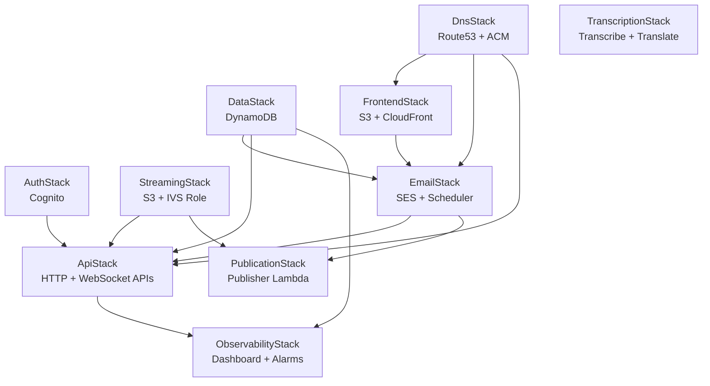
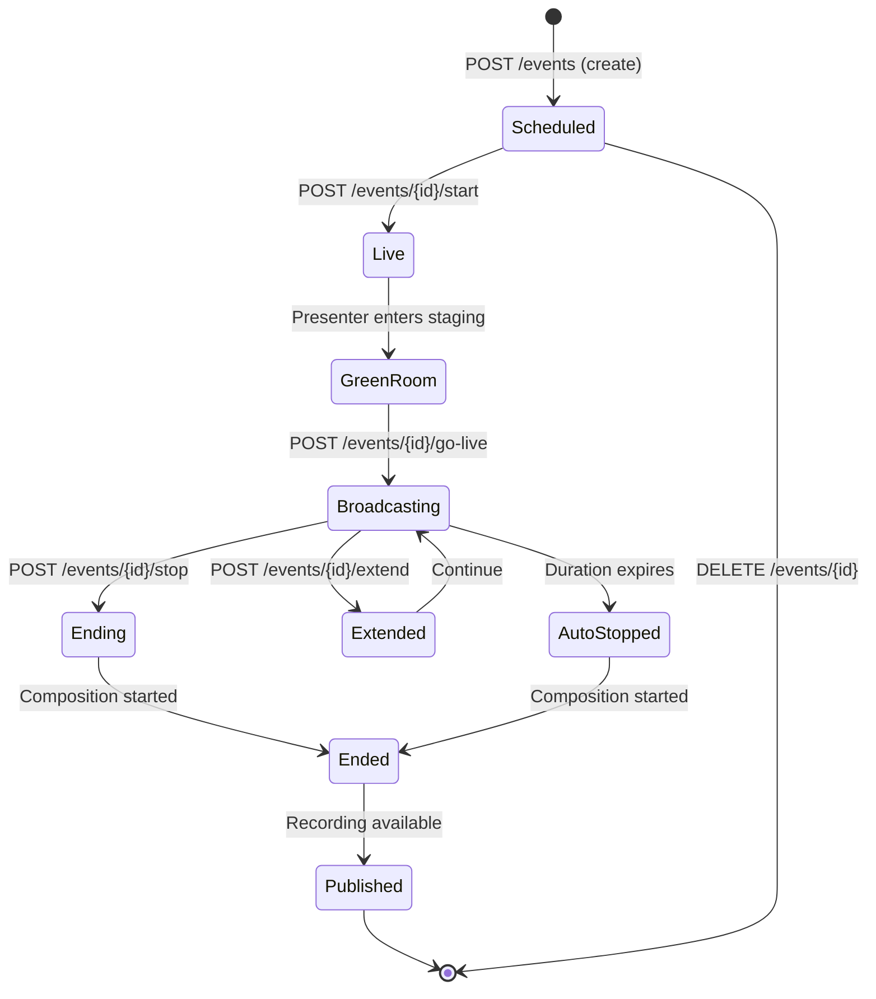
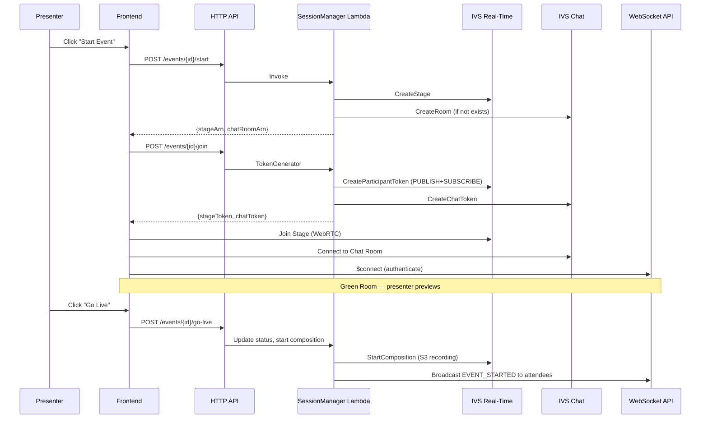
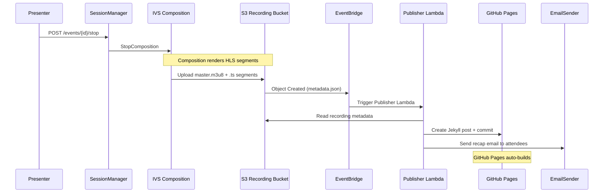
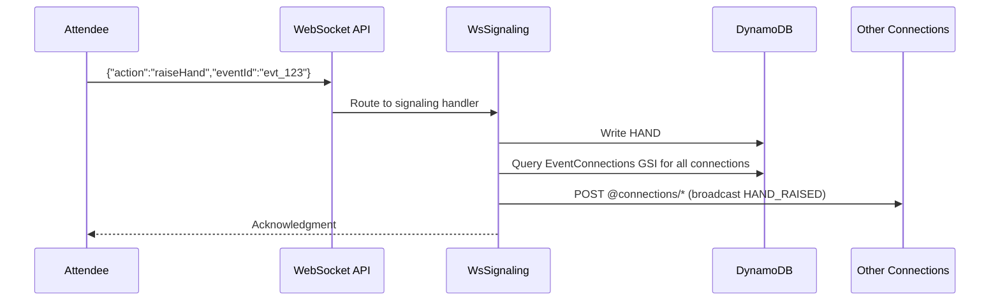
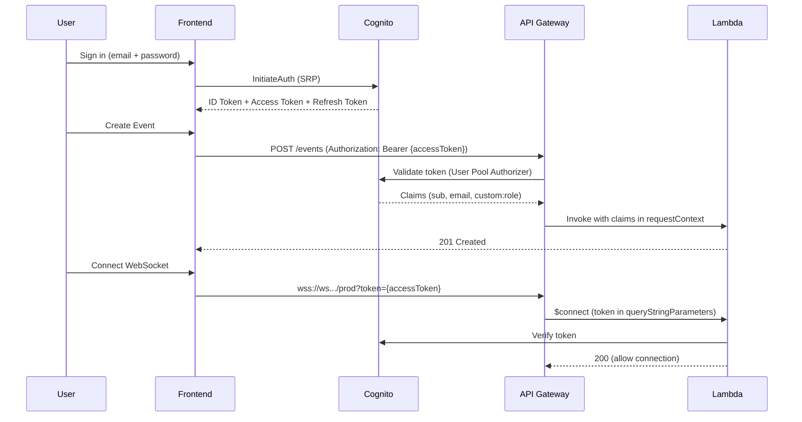
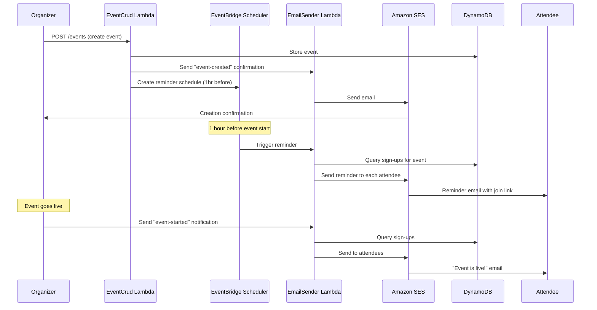

# Architecture

## High-Level System Architecture

The AWS Virtual Meetups Platform is a fully serverless application built on AWS. It uses IVS Real-Time for sub-300ms latency WebRTC streaming, API Gateway WebSocket for real-time signaling, and a Lambda + DynamoDB backend for all business logic.

```mermaid
graph TB
    subgraph "DNS & TLS"
        R53[Route53<br/>awsvirtualmeetups.com]
        ACM[ACM Certificate<br/>apex + wildcard]
    end

    subgraph "Frontend"
        CF_FE[CloudFront<br/>SPA Distribution]
        S3_FE[S3 Bucket<br/>Static Assets]
        WAF_FE[WAF WebACL<br/>CLOUDFRONT scope]
    end

    subgraph "API Layer"
        APIGW_HTTP[API Gateway HTTP API<br/>api.awsvirtualmeetups.com]
        APIGW_WS[API Gateway WebSocket<br/>ws.awsvirtualmeetups.com]
        WAF_API[WAF WebACL<br/>REGIONAL scope]
    end

    subgraph "Authentication"
        COGNITO_UP[Cognito User Pool<br/>Email sign-up + MFA]
        COGNITO_IP[Cognito Identity Pool]
    end

    subgraph "Compute (Lambda)"
        FN_CRUD[EventCrud]
        FN_SESSION[SessionManager]
        FN_TOKEN[TokenGenerator]
        FN_SIGNUP[Signup]
        FN_WS_CONN[WsConnect]
        FN_WS_DISC[WsDisconnect]
        FN_WS_SIG[WsSignaling]
        FN_EMAIL[EmailSender]
        FN_PUB[Publisher]
        FN_IVS[IvsMetrics]
        FN_ADMIN[AdminApi]
    end

    subgraph "Data"
        DDB_MAIN[(DynamoDB<br/>VirtualMeetupTable)]
        DDB_CONN[(DynamoDB<br/>WebSocketConnections)]
    end

    subgraph "Streaming & Recording"
        IVS_STAGE[IVS Real-Time Stage<br/>WebRTC]
        IVS_CHAT[IVS Chat Room]
        IVS_COMP[IVS Server-Side Composition]
        S3_REC[S3 Recording Bucket]
        CF_REC[CloudFront<br/>Recording Distribution]
    end

    subgraph "Notifications"
        SES[Amazon SES<br/>noreply@awsvirtualmeetups.com]
        EB_SCHED[EventBridge Scheduler<br/>Reminders & Auto-Stop]
        SNS[SNS Alarm Topic]
    end

    subgraph "Observability"
        CW_DASH[CloudWatch Dashboard]
        CW_ALARMS[CloudWatch Alarms]
        CW_LOGS[CloudWatch Logs]
    end

    R53 --> CF_FE
    R53 --> APIGW_HTTP
    R53 --> APIGW_WS
    ACM --> CF_FE
    ACM --> APIGW_HTTP
    ACM --> APIGW_WS

    WAF_FE --> CF_FE
    CF_FE --> S3_FE

    APIGW_HTTP --> FN_CRUD
    APIGW_HTTP --> FN_SESSION
    APIGW_HTTP --> FN_TOKEN
    APIGW_HTTP --> FN_SIGNUP
    APIGW_WS --> FN_WS_CONN
    APIGW_WS --> FN_WS_DISC
    APIGW_WS --> FN_WS_SIG

    COGNITO_UP --> APIGW_HTTP

    FN_CRUD --> DDB_MAIN
    FN_SESSION --> DDB_MAIN
    FN_TOKEN --> DDB_MAIN
    FN_SIGNUP --> DDB_MAIN
    FN_WS_CONN --> DDB_CONN
    FN_WS_DISC --> DDB_CONN
    FN_WS_SIG --> DDB_CONN
    FN_WS_SIG --> DDB_MAIN

    FN_SESSION --> IVS_STAGE
    FN_TOKEN --> IVS_STAGE
    FN_TOKEN --> IVS_CHAT
    FN_SESSION --> IVS_COMP
    IVS_COMP --> S3_REC
    S3_REC --> CF_REC

    FN_CRUD --> FN_EMAIL
    FN_SESSION --> FN_EMAIL
    FN_EMAIL --> SES
    EB_SCHED --> FN_EMAIL
    EB_SCHED --> FN_SESSION

    CW_ALARMS --> SNS
    FN_IVS --> CW_DASH
```



## CDK Stack Dependency Graph



## Data Flow Diagrams

### Event Lifecycle



### Live Session Flow



### Recording Pipeline



## DynamoDB Single-Table Design

### Key Patterns

| Entity | PK | SK | Purpose |
|--------|----|----|---------|
| Event | `EVENT#{eventId}` | `METADATA` | Event details, status, IVS ARNs |
| Sign-Up | `EVENT#{eventId}` | `SIGNUP#{userId}` | Registration record |
| Hand Raised | `EVENT#{eventId}` | `HAND#{timestamp}#{userId}` | Active raised hand |
| Question | `EVENT#{eventId}` | `QUESTION#{timestamp}#{qId}` | Q&A queue item |
| Recording | `EVENT#{eventId}` | `RECORDING` | Recording URLs and metadata |
| User Profile | `USER#{userId}` | `PROFILE` | User details and role |

### Global Secondary Indexes

| GSI | Partition Key | Sort Key | Access Pattern |
|-----|--------------|----------|----------------|
| GSI1 | `EVENTS#UPCOMING` | `{scheduledStart}#{eventId}` | List upcoming events sorted by date |
| GSI2 | `USER#{userId}#EVENTS` | `{scheduledStart}#{eventId}` | List events by organizer |

### Connections Table

Separate table for WebSocket connection management with TTL-based cleanup:

| Key | Attributes | Purpose |
|-----|-----------|---------|
| `connectionId` (PK) | eventId, userId, role, ttl | Connection lookup |
| GSI: `EventConnections` (PK: eventId, SK: connectionId) | All | Broadcast to event participants |

## WebSocket Communication Flow



### WebSocket Message Types (Server → Client)

| Type | Trigger | Data |
|------|---------|------|
| `HAND_RAISED` | Attendee raises hand | userId, displayName, timestamp |
| `HAND_LOWERED` | Hand dismissed/lowered | userId |
| `ALL_HANDS_LOWERED` | Presenter clears all | — |
| `QUESTION_SUBMITTED` | New question | questionId, text, userId |
| `QUESTION_ANSWERED` | Presenter answers | questionId, answer |
| `QUESTION_DISMISSED` | Presenter dismisses | questionId |
| `QUESTION_PINNED` | Question pinned | questionId |
| `USER_PROMOTED` | Role change | userId, newRole |
| `USER_DEMOTED` | Role change | userId |
| `SPEAK_GRANTED` | Permission granted | userId |
| `SPEAK_REVOKED` | Permission revoked | userId |
| `CHAT_TOGGLED` | Chat enabled/disabled | enabled (boolean) |
| `EVENT_STARTED` | Go live | — |
| `EVENT_ENDING_SOON` | Warning | minutesRemaining |
| `EVENT_STOPPED` | Session ended | recordingUrl |
| `ATTENDEE_JOINED` | New attendee | userId, displayName |
| `ATTENDEE_LEFT` | Attendee disconnected | userId |
| `USER_MUTED` | Audio muted by presenter | userId |
| `USER_KICKED` | Removed from session | userId, reason |
| `USER_BANNED` | Permanently banned | userId |

## Authentication Flow



## Recording Pipeline (IVS → S3 → CloudFront)

```mermaid
graph LR
    subgraph "Live Session"
        STAGE[IVS Real-Time Stage<br/>Multiple Publishers]
    end

    subgraph "Composition"
        COMP[Server-Side Composition<br/>HD 720p, 30fps]
    end

    subgraph "Storage"
        S3[S3 Recording Bucket<br/>recordings/{eventId}/]
    end

    subgraph "Delivery"
        CF[CloudFront Distribution<br/>HLS Playback]
    end

    subgraph "Lifecycle"
        IA[S3 IA<br/>After 30 days]
        GLACIER[S3 Glacier<br/>After 90 days]
    end

    STAGE --> COMP
    COMP --> S3
    S3 --> CF
    S3 --> IA
    IA --> GLACIER
```

Recording format: HLS (HTTP Live Streaming) with `.m3u8` manifest and `.ts` segments, served via CloudFront with CORS headers for cross-origin playback.

## Email Notification Flow



### Email Types

| Type | Trigger | Recipients |
|------|---------|-----------|
| `event-created` | Event creation | Organizer |
| `event-reminder` | EventBridge Schedule (1hr before) | All sign-ups |
| `event-started` | Go live | All sign-ups |
| `signup-confirmation` | Attendee registers | Attendee |
| `event-cancelled` | Event deleted | All sign-ups |
| `event-recap` | Recording published | All sign-ups |

## AWS Services Used

| Service | Purpose |
|---------|---------|
| Route53 | DNS hosting, domain routing |
| ACM | TLS certificates (apex + wildcard) |
| CloudFront | CDN for frontend SPA and recording playback |
| S3 | Static hosting, recording storage |
| API Gateway (HTTP) | REST API for event management |
| API Gateway (WebSocket) | Real-time signaling and state |
| Lambda | All compute (11 functions) |
| DynamoDB | Primary data store (single-table + connections) |
| Cognito | Authentication and authorization |
| SES | Transactional email notifications |
| EventBridge Scheduler | Timed reminders and auto-stop |
| IVS Real-Time | WebRTC streaming (stages) |
| IVS Chat | Group and direct messaging |
| IVS Composition | Server-side recording |
| CloudWatch | Logs, metrics, dashboard, alarms |
| WAF | Rate limiting, managed rules, DDoS protection |
| SNS | Alarm notifications |
| Secrets Manager | GitHub token storage |
| SQS | Dead letter queues (email, publication) |
