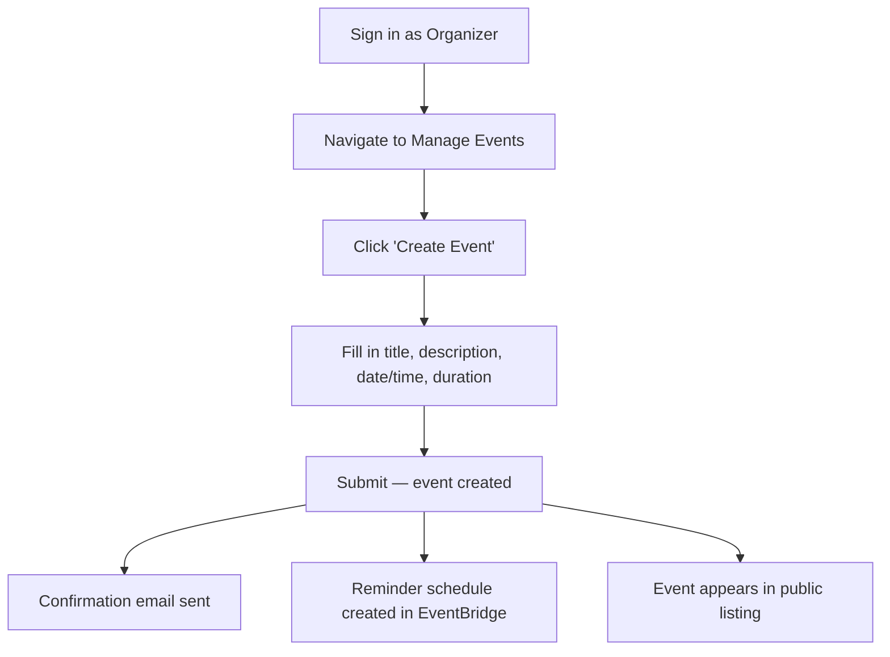
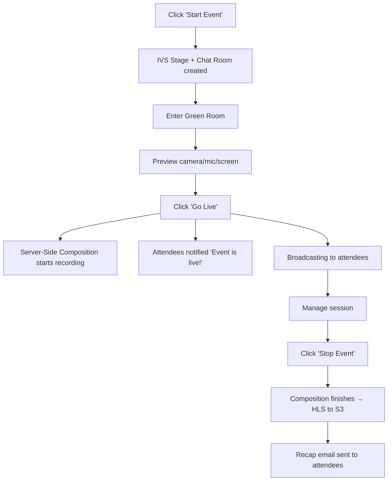
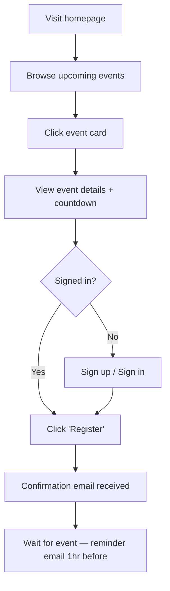
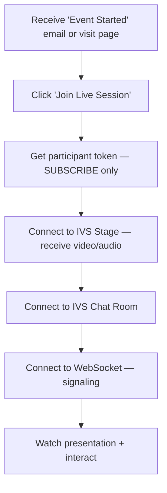
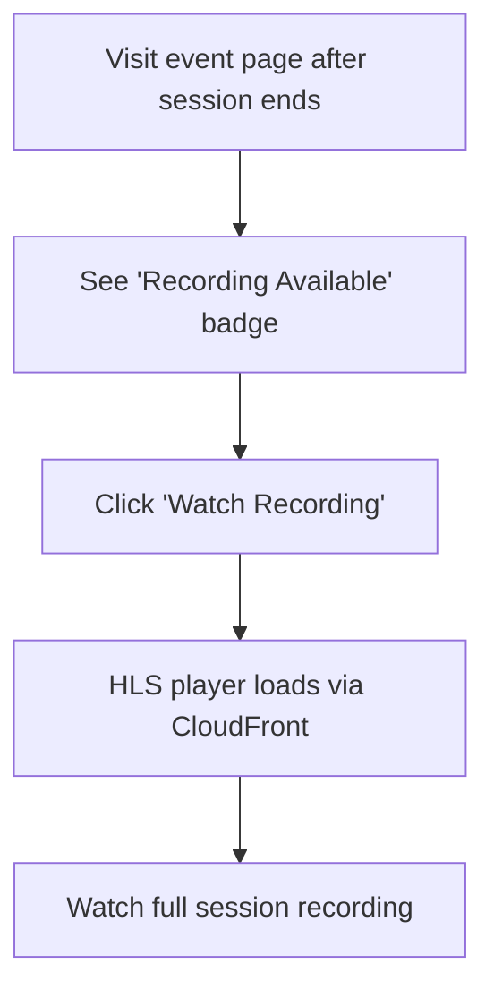
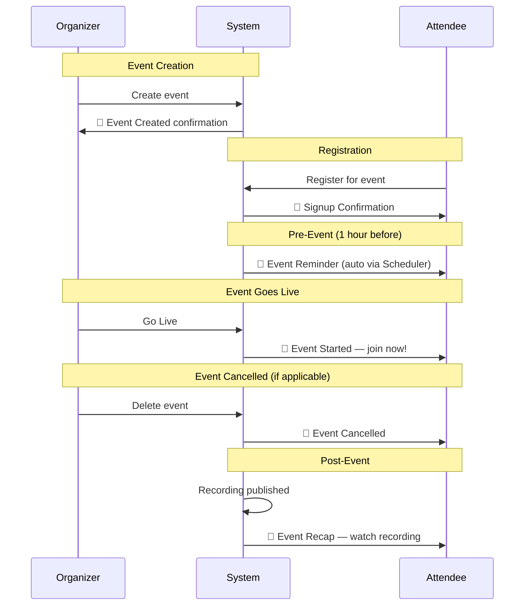
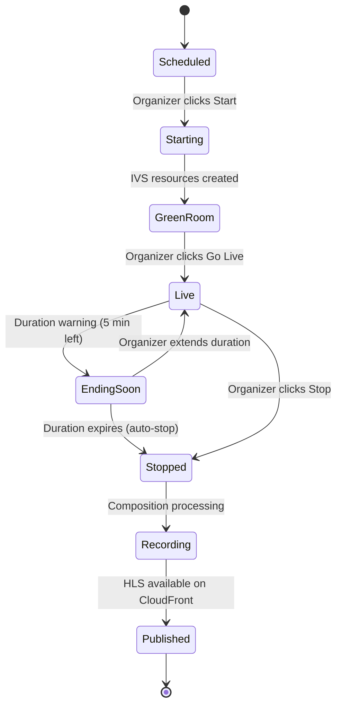

# Workflows

## Organizer Workflow

### Create and Manage an Event

### Run a Live Session

### Detailed Organizer Steps

1. **Sign in** — Authenticate with email/password via Cognito
2. **Create event** — Set title, description, scheduled start time, and duration
3. **Wait for event time** — Attendees register, reminder emails sent automatically
4. **Start event** — Creates IVS Stage and Chat Room, enters Green Room
5. **Green Room** — Select camera, microphone, and screen share; preview video/audio
6. **Go Live** — Transitions to broadcasting; composition recording begins; attendees can join
7. **Manage session** — Use Presenter Dashboard to:
   - View attendee list with roles
   - Manage question queue (answer, dismiss, pin)
   - Handle raised hands (acknowledge, dismiss, grant speak)
   - Moderate (mute audio, restrict chat, kick, ban)
   - Monitor event duration and extend if needed
8. **Stop event** — Ends the live session, stops composition, triggers recording pipeline
9. **Post-event** — Recording published to CloudFront; recap email sent to attendees

## Attendee Workflow

### Browse and Register

### Join a Live Session

### Interact During Session

| Action | How | Result |
|--------|-----|--------|
| Send chat message | Type in chat input, press Enter | Message appears for all attendees |
| Send direct message | Switch to "Direct" tab, type message | Only presenter sees it |
| Ask a question | Click Q&A tab, type question, submit | Question enters presenter's queue |
| Raise hand | Click hand icon | Presenter sees raised hand in panel |
| Lower hand | Click hand icon again | Hand removed from presenter's panel |
| Speak (if granted) | Presenter grants permission | Mic unmuted, audio broadcast to all |

### Watch a Recording

## Presenter During Session

### Device Setup (Green Room)

1. **Camera selection** — Dropdown lists available video devices; preview shows selected feed
2. **Microphone selection** — Dropdown lists audio input devices; level meter shows input
3. **Screen share** — Click to select screen/window/tab for sharing
4. **Device audio** — Option to share system audio (for demos with sound)
5. **Preview** — See exactly what attendees will see before going live

### Screen Sharing

- Click "Share Screen" button → browser native picker appears
- Select entire screen, application window, or browser tab
- Screen share publishes as a separate stream alongside webcam
- Click "Stop Sharing" to end screen share
- Can toggle between screen share and webcam-only

### Q&A Management

| Action | Button | Effect |
|--------|--------|--------|
| View questions | Q&A panel (auto-opens on new question) | See queue in submission order |
| Answer with text | Click "Answer" → type response | Answer broadcast to all; question marked answered |
| Pin question | Click pin icon | Question pinned at top of attendee view |
| Unpin question | Click unpin icon | Question returns to normal position |
| Dismiss question | Click "Dismiss" | Question removed from active queue |

### Moderation Tools

| Action | Effect | Reversible |
|--------|--------|-----------|
| Mute audio | Target user's mic muted server-side | Yes — user can be unmuted |
| Restrict chat | Target user cannot send group messages | Yes — can be unrestricted |
| Kick | User removed from session immediately | User can rejoin |
| Ban | User removed and cannot rejoin | Requires admin to unban |

### Hand Raising Management

1. **See raised hands** — Hands panel shows list ordered by raise time
2. **Acknowledge** — Click to acknowledge (visual indicator to attendee)
3. **Grant speak** — Give attendee PUBLISH capability; their mic goes live
4. **Revoke speak** — Remove PUBLISH capability; attendee returns to listen-only
5. **Dismiss hand** — Lower the attendee's hand without granting speak
6. **Lower all hands** — Clear all raised hands at once

## Email Lifecycle

### Email Details

| Email | When Sent | Contains |
|-------|-----------|----------|
| Event Created | Immediately on creation | Event title, date, manage link |
| Signup Confirmation | Immediately on registration | Event title, date, calendar link |
| Event Reminder | 1 hour before scheduled start | Event title, join link, countdown |
| Event Started | When presenter clicks Go Live | Join link, event title |
| Event Cancelled | When organizer deletes event | Event title, apology |
| Event Recap | When recording is published | Recording link, duration, highlights |

## Session State Transitions

## Concurrent Event Isolation

Each event operates independently:

- **Separate IVS Stage** — No cross-event audio/video leakage
- **Separate Chat Room** — Messages scoped to event
- **Separate WebSocket namespace** — Broadcasts filtered by `eventId`
- **Separate DynamoDB partition** — `EVENT#{eventId}` isolation
- **Separate recording** — Independent composition per stage

An organizer can run multiple events simultaneously. Attendees can only be in one live session at a time (enforced by the frontend).
